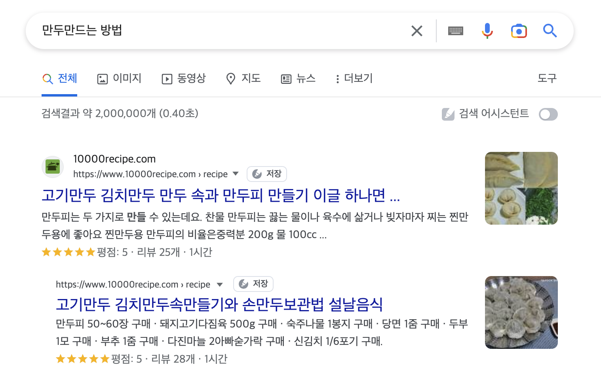
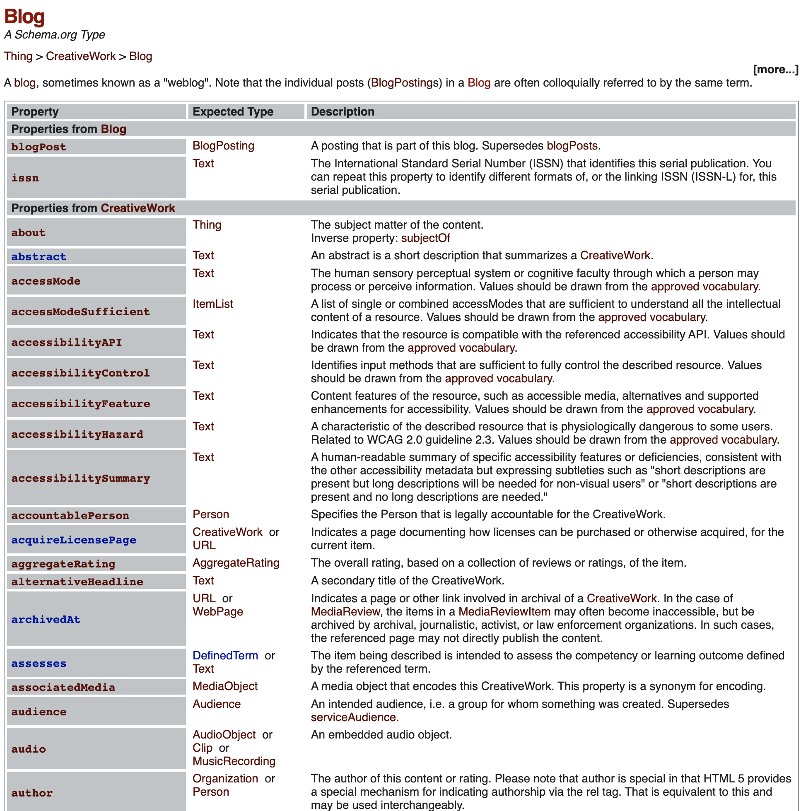

## ‍구조화된 데이터란?
웹 페이지에 있는 정보를 구조화하여 검색 엔진이 이를 이해하기 쉽도록 만드는 것을 의미합니다.
예를 들어, 제목, 저자, 출판사, 출판일 등의 정보를 태그로 감싸는 것입니다. 
검색 엔진은 이러한 정보를 수집하여([리치 스니펫](https://developers.google.com/search/docs/appearance/structured-data/intro-structured-data?hl=ko)) 검색 결과를 더욱 정확하게 제공할 수 있습니다.

> Snippets은 검색어와 관련된 정보를 미리 보여주는 정보 블록으로, 사용자가 검색 결과를 더 빠르게 식별하고 선택할 수 있도록 도와줍니다.

<br/>



콘텐츠에 구조화된 데이터를 제공할 경우 위와 같이 더 풍부한 검색 결과를 제공할 수 있으며, 이는 검색을 하는 사용자들이 해당 사이트의 유입률을 높여줄 수 있습니다.

<br/>

## ‍구조화된 데이터란 어떻게 작성하는가?
### [schema.org](https://schema.org/docs/schemas.html)
구글, 마이크로소프트, 야후, 어도비 등의 대형 인터넷 기업들이 공동으로 개발한 구조화된 데이터 마크업 언어입니다.
이 언어를 사용하면 웹페이지의 콘텐츠를 구조화된 데이터로 표현할 수 있어 검색 엔진이 이해하기 쉬운 형식으로 정보를 전달할 수 있습니다.

<br>

### 구조화된 데이터 제작을 위한 언어 형식
구조화된 데이터를 제작하기 위해 사용되는 언어 형식은 JSON-LD, Microdata, RDFa 등이 있습니다.
이 중에서도 가장 일반적으로 사용되는 언어 형식은 `JSON-LD`입니다.

`JSON-LD`는 JSON 형식을 확장하여 구조화된 데이터를 표현하는 방법으로, 검색 엔진이 이를 쉽게 이해하고 분석할 수 있도록 해줍니다.

또한 JSON-LD는 HTML 문서 내에 직접 삽입되는 것이 아니라, 외부 파일로 작성되기 때문에 HTML 문서의 가독성을 높일 수 있습니다.
그리고 구글과 네이버의 경우 `JSON-LD` 형식을 권장하기 때문에 가급적 해당 언어를 이용하여 구조화된 데이터 작업을 진행하는 것이 좋습니다.

<br>

## 구조화된 데이터 적용(JSON-LD)


구조화된 데이터 작업을 위해서는 타입(type)과 속성(property)값을 정의해야 합니다. 아래와 같이 [blog](https://schema.org/Blog)는 타입(유형)이 되며,
속성에는 headline, description, datePublished, author(속성이 동시에 타입이 될 수 있습니다.)
그리고 아래와 같이 페이지 헤드 또는 본문의 태그 내에 삽입합니다.

```js
<script type="application/ld+json">
  {
    "@context": "http://schema.org",
    "@type": "Blog",
    "headline": "제목",
    "description": "설명",
    "datePublished": "2023-03-24",
    "author": {
        "@type": "Person",
        "name": "작성자"
    }
  }
</script>
```

<br>

### Next.js에 구조화 데이터 적용 방법
1. Head 컴포넌트와  외부 라이브러리 next-seo에서 제공하는 [`ArticleJsonLd`](https://github.com/garmeeh/next-seo#json-ld)사용하여, HTML head 태그에 구조화된 데이터를 추가하는 방법
   ```jsx
   import Head from 'next/head';
   import { ArticleJsonLd } from 'next-seo';
   
   function MyPage() {
     return (
       <div>
         <Head>
           <ArticleJsonLd
             title="Article Title"
             url="https://www.example.com/article"
             images={[
               'https://www.example.com/og-image.jpg',
             ]}
             datePublished="2023-01-01T08:00:00+08:00"
             dateModified="2023-01-02T08:00:00+08:00"
             authorName="Kay"
             publisherName="Example.com"
             publisherLogo="https://www.example.com/logo.png"
             description="This is an article about Next.js"
           />
         </Head>
         <div>
           {/* ... */}
         </div>
       </div>
     );
   }
   ```

2. getInitialProps를 사용하여 JSON-LD 형식의 구조화된 데이터를 추가하는 방법
   ```jsx
   function MyPage({ article }) {
     return (
       <div>
         {/* ... */}
         <script
           type="application/ld+json"
           dangerouslySetInnerHTML={{ __html: JSON.stringify(article) }}
         />
       </div>
     );
   }
   
   MyPage.getInitialProps = async () => {
     const article = {
       '@context': 'https://schema.org',
       '@type': 'Article',
       headline: 'Article Title',
       image: 'https://www.example.com/og-image.jpg',
       datePublished: '2023-01-01T08:00:00+08:00',
       dateModified: '2023-01-02T08:00:00+08:00',
       author: {
         '@type': 'Person',
         name: 'Kay',
       },
     };
   
     return { article };
   };
   ```

<br/>

> dangerouslySetInnerHTM은 브라우저 DOM에서 innerHTML을 사용하기 위한 React의 대체 방법이지만, 일반적으로 코드에서 HTML을 설정하는 것은 사이트 간 스크립팅 공격에 쉽게 노출될 수 있기 때문에 위험합니다. 
> 
> 따라서 React에서 직접 HTML을 설정할 수는 있지만, 위험하다는 것을 상기시키기 위 dangerouslySetInnerHTML을 작성하고 __html 키로 객체를 전달해야 합니다.

```jsx
const termsContent = `${data?.terms?.content}`;

<div dangerouslySetInnerHTML={{ __html: termsContent }} />
```

<br/>

### XSS, CSRF 공격
1. 사이트 간 스크립팅(Cross-Site Scripting, XSS) 공격
   - 악성 사용자가 웹 페이지에 악성 스크립트를 삽입하여, 해당 페이지를 방문하는 사용자의 브라우저를 조작하는 공격
   - 이는 사용자의 세션을 탈취하거나, 사용자의 정보를 도용하는 등의 피해를 줄 수 있음
2. 크로스 사이트 스크립팅(Cross-Site Request Forgery, CSRF) 공격
   - 악성 사용자가 사용자의 브라우저를 이용하여, 해당 사용자가 인증된 상태에서 악성 요청을 보내는 공격
   - 이는 사용자의 권한을 이용해서 악성 요청을 실행할 수 있으며, 이를 통해 공격자가 사용자의 정보를 탈취하거나, 불법적인 동작을 실행할 수 있음
3. 위 공격 방지 방법
   - 입력값 검증 및 필터링: 사용자로부터 입력된 데이터 중, 이상한 문자나 스크립트를 필터링하거나, 검증하는 방법으로 XSS, CSRF 공격을 방지할 수 있음
   - 쿠키 보호: 쿠키를 이용하여 세션을 유지하는 경우, 쿠키를 보호할 수 있는 방법 (ex: HttpOnly, Secure)을 사용해서 CSRF 공격을 방지할 수 있음
   - CSRF 토큰 사용: CSRF 공격을 방지하기 위해, 사용자와 서버 간에 CSRF 토큰을 생성하여, 악성 요청인지 아닌지를 판단하는 방법을 사용할 수 있음
   - CSP(Content Security Policy) 설정: CSP를 사용하여, 허용된 도메인 및 리소스만 로드하도록 제한함으로써, XSS 공격을 방지할 수 있음

<br/>

## 구조화된 데이터를 적용 후, 얻은점과 배운점
구조화된 데이터를 적용하여 구글뿐만 아니라 네이버에도 콘텐츠의 세부 내용을 노출시켜 플랫폼 유입을 늘릴 수 있었습니다.
이 과정에서 SEO 중요성을 인지하고, SEO 점수를 높일 수 있는 다양한 방법들을 탐색하면서 경험을 넓혔습니다.
앞으로는 개발만 하는 것이 아니라, 개발을 통해 비즈니스에 긍정적인 영향을 줄 수 있는 방법을 고민하는 개발자가 되어야겠다는 다짐을 하게 되었습니다.

<br>

### 참고
- [schema.org](https://schema.org/docs/schemas.html)
- [Adding Structured Data in Next.js](https://www.codeconcisely.com/posts/nextjs-structured-data/)
- [구조화된 데이터 적용하기](https://growthacking.kr/seo-%EA%B5%AC%EC%A1%B0%ED%99%94%EB%90%9C-%EB%8D%B0%EC%9D%B4%ED%84%B0-%EC%A0%81%EC%9A%A9%ED%95%98%EA%B8%B0/)
- [구조화된 데이터 일반 가이드라인 - 구글](https://developers.google.com/search/docs/appearance/structured-data/sd-policies?hl=ko)

```toc
```
