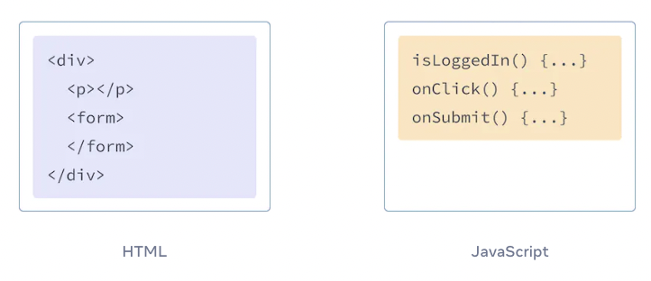
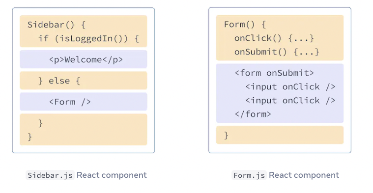

> 이 글은 [React Beta 공식 문서 - Writing Markup with JSX
](https://beta.reactjs.org/learn/writing-markup-with-jsx)를 번역한 것 입니다.

<br>

# Writing Markup with JSX
`JSX`문법은 JS파일 안에서 JS를 통해 HTML 마크업을 할 수 있도록 하는 문법입니다.
컴포넌트를 작성하는 다른 방법도 있지만, 대부분의 React 개발자는 JSX문법을 사용하는 것을 선호 합니다.

<b>우리가 배우게 될 내용들</b>
- React가 마크업과 랜더링 로직을 혼합한 이유
- JSX가 HTML과 다른 점
- JSX로 정보를 나타내는 방법

<br>

## JSX: Putting markup into JavaScript
WEB은 HTML, CSS, JS를 기반으로 구축되었습니다. 수년 동안, 웹 개발자들은 개발 할 때 콘텐츠는 HTML에, 디자인은 CSS에 로직은 JS에 각각 별도의 파일에서 관리했습니다.
콘텐츠는 HTML안에 마크업 되고, 웹 페이지 로직은 JS안에 별도로 있었습니다.



그러나 웹이 점점 인터렉티브하게 되어지면서, JS 로직이 콘텐츠를 결정하는 비중이 점점 커졌습니다.
<b>그래서 React는 컴포넌트에 랜더링 로직과 마크업이 함께 존재하게 되었습니다.<b/>



### Note

<br/>

## Converting HTML to JSX

### Note

<br/>

## The Rules of JSX

### 1. Return a single root element

### DEEP DIVE: Why do multiple JSX tags need to be wrapped?

### 2. Close all the tags

### 3. camelCase all most of the things!

### Pro-tip: Use a JSX Converter

<br/>

## Recap
- 1
- 2
- 3

<br/>

<b>📕 참고</b>
- [React Beta - Writing Markup with JSX
  ](https://beta.reactjs.org/learn/writing-markup-with-jsx)

```toc
```
