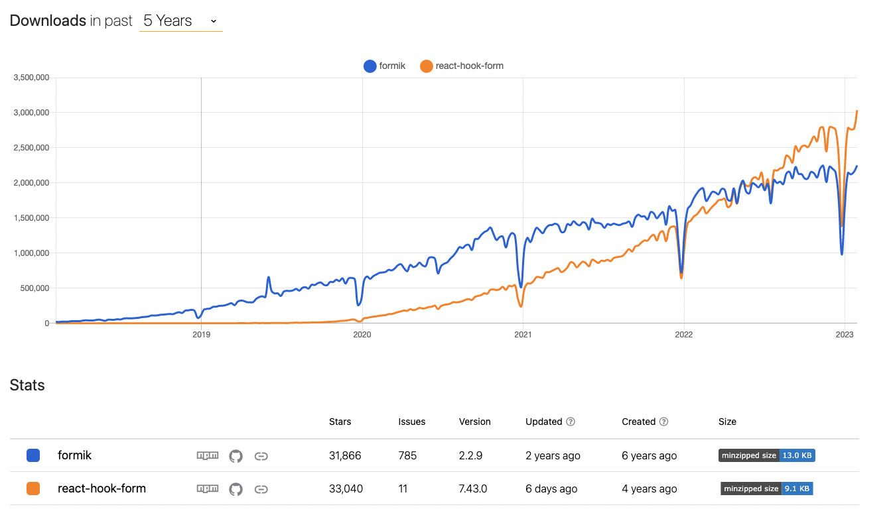
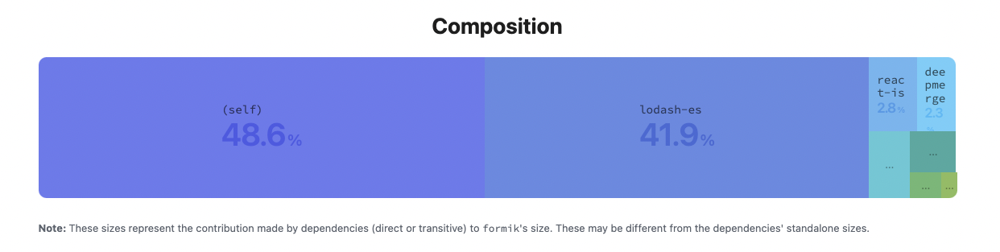
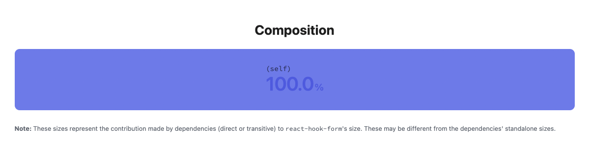
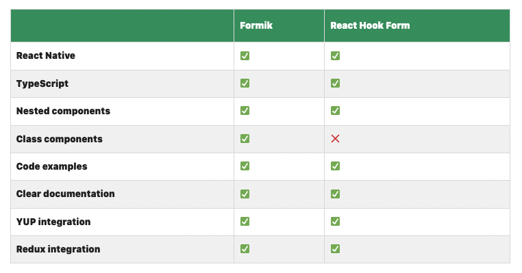

<br/>

> 이 글은 Siegfried Grimbeek가 작성한 <b>[React Hook Form vs. Formik: A technical and performance comparison](https://blog.logrocket.com/react-hook-form-vs-formik-comparison/)</b> 일부를 번역한 글 입니다.

<br/>

# 소개
우리는 React로 개발하면서 Form에 대한 많은 어려움을 겪고 있습니다. 예를 들어 Form 안의 정보 조작, 유효성 검사, 상태 관리 등의 어려움을 가지고 개발을 하고 있습니다.

이러한 문제점을 해결해 주기 위해, [Formik](https://formik.org/)이 개발되어졌고 더 나아가, Formik의 일부 단점을 해결해주기 위해 [React Hook Form](https://react-hook-form.com/)이 등장했습니다.

<br/>

# React Hook Form과 Formik의 비교
다음은 React Hook Form과 Formik의 [다운로드 통계](https://npmtrends.com/formik-vs-react-hook-form)입니다.
아래와 같이 2022년 부터 React Hook Form의 다운로드 수가 Formik을 넘어섰습니다.



단순히 다운로스 수가 많다고 어떤 라이브러리가 더 좋다고 판단 할 수 없습니다. 대신 위에 보이는 라이브러리의 <b>사이즈, 최근 업데이트 날짜, 이슈 수</b> 등은 좋의 라이브러리를 판단하는 좋은 요소가 됩니다.

## Size
`minzipped size`를 비교 했을 때, React Hook Form이 Fomik보다 4KB가 적습니다.

<br>

## Dependencies
종속성이 적을 수록 라이브러리는 좋습니다. 왜냐하면 Side Effect가 없어, 개발하는 프로젝트에 악영향을 미치지 않기 때문입니다.

[Formik Module Composition](https://bundlephobia.com/package/formik@2.2.9)

<b>Formik에는 8개의 종속된 요소들이 있습니다.</b>

<br/>

[React Hook Form Module Composition](https://bundlephobia.com/package/react-hook-form@7.43.0)

<b>React Hook Form에는 종속된 요소가 없습니다.</b>

<br>

## Performance - Rendering
컴포넌트 리랜더링은 React에서 기능을 구현할 때 고려해야 할 중요한 요소 입니다. 앱이 커짐에 따라 주요 성능 문제로 이어질 수 있으므로 불필요한 재랜더링을 가능한 한 피해야 합니다.
아래는 Formik과 React Hook Form을 사용했을 때, 랜더링이 일어나는 수를 측정한 것입니다.

### Formik
- 총 랜더링 수 30 이상


### React Hook Form
- 총 랜더링 수 3

Total re-renders: 3</p>
" data-medium-file="https://blog.logrocket.com/wp-content/uploads/2019/10/react-hook-form-re-renders-214x300.gif" data-large-file="https://blog.logrocket.com/wp-content/uploads/2019/10/react-hook-form-re-renders.gif" decoding="async" class="size-full wp-image-8676 jetpack-lazy-image jetpack-lazy-image--handled" src="https://blog.logrocket.com/wp-content/uploads/2019/10/react-hook-form-re-renders.gif" alt="React Hook Form 리렌더링" width="500" height="629" data-lazy-loaded="1" loading="eager">

왜 이런 차이가 나는 걸까요?? 그 이유는 각각의 라이브러리의 아키텍처 설계 방식이 다르기 때문입니다. React Hook Form은 <b>비제어 컴포넌트 방식</b>으로 구현되어 있기에 불필요한 랜더링 이슈를 해결합니다.
즉, 단일 Form 값 변경에 대해 전체 Form이 다시 랜더링 되는 것을 방지 합니다.

Formik을 포함한 다른 라이브러리는 단일 Form 값 변경에 대해 전체 Form이 연결되어 있어, 전체 Form과 유연하나는 관점에서는 장점이 있으나, 거대한 랜더링 비용이 드는 건 사실입니다.

<br/>

## Performance - Mount
React 프로젝트 개발에 있어 또 다른 성능 문제는 React Component를 DOM에 삽입하는데 걸리는 시간을 나타내는 `Mount`시간입니다.
당연히 Mount시간이 길면, 브라우저 랜더링 시간에 영향을 줘 사용자 경험에 좋지 않은 영향을 끼치기 때문에 가능한 짧은 `Mount`시간을 목표로 해야 합니다.

아래는 단순한 컴포넌트를 Formik과 React Hook Form으로 테스트 한 결과 입니다.
단순한 컴포넌트가 아닌, 복잡한 컴포넌트를 테스트 하게 된다면, 차이는 심하게 날 것입니다.

### Formik 
- Mount : 6
- Committing Change : 1
- Total time: 2070ms


### React Hook Form
- Mount : 1
- Committing Change : 1
- Total time: 1800ms
  


<br/>

React Commit
- Component의 State를 업데이트 하는 과정(자식 Component와 자신을 리랜더링하는 과정)

<br/>

## 결론
각 상황에 맞게 프로젝트 내부에 Formik과 React Hook Form을 사용하면 됩니다.

추가로 아래는 Formik과 React Hook Form을 상황별로 정리한 내용입니다.


<br/>

## 추가
저희 팀에서 React Hook Form을 선택한 이유는 디자인 시스템과 호환 가능한 라이브러리를 선택해야 했기 때문입니다.
기획 요구사항에 맞는 UI를 개발해야 했기 때문에 React Hook Form은 적합한 선택이었습니다.
특히 `UnControlled`이라는 큰 장점이 있어, Form 전체의 의존성 없이 독립적으로 관리할 수 있었습니다.
각 입력 필드의 이름만 Props으로 전달하면, 다양한 필드의 Form을 관리할 수 있습니다.
또한, `useController` 내부 `errors` 객체를 사용하여 각 입력 인터페이스 역할을 하는 디자인 시스템 컴포넌트에
에러의 존재 여부와 에러 메세지를 전달하여 에러관련된 UI를 손쉽게 관리할 수 있습니다.

  ```jsx
  const InputField = ({...props}) => {
    const { field, ...restProps } = useController({
      name: fieldName,
    });
  
    // 디자인 시스템 Input 컴포넌트
    return (
     <Input
       {...field}
       errorText={errorMessage}
       isError={!!errorMessage}
      />
     );
    }   
  ```

<br/>

## 📕 참고
- [React Hook Form Builder](https://react-hook-form.com/form-builder/)
- [React Render and Commit](https://beta.reactjs.org/learn/render-and-commit)
- [React Hook Form을 선택한 이유 - 인프랩](https://tech.inflab.com/202207-rallit-form-refactoring/react-hook-form/)


```toc
```
