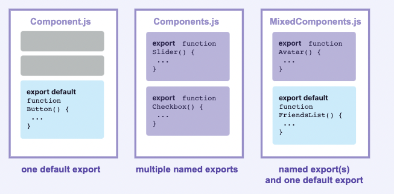

> 이 글은 [React 공식 문서 - Importing and Exporting Components](https://reactjs.org/learn/importing-and-exporting-components)를 번역한 것 입니다.

<br>

# Importing and Exporting Components
컴포넌트의 가장 큰 장점은 <b>재사용성</b>입니다. 대신 주의 해야할 부분은 하나의 컴포넌트 안에 다양한 컴포넌트가 중첩 될 때, 다른 파일로 분할해서 관리하는 것이 좋습니다.
이렇게 하면, 컴포넌트를 관리하기 편합니다.

<b>우리가 배우게 될 내용들</b>
- Root 컴포넌트의 의미
- 컴포넌트를 import 및 export 하는 방법
- default, named import, export 사용 방법
- import 하는 방법과 하나의 파일에서 여러개의 컴포넌트를 export하는 방법
- 컴포넌트를 여러 파일로 분할하는 방법

<br>

## The root component file
기본적으로 CRA(Create React App)을 실행하면, `scr/App.js`에 루트 컴포넌트 파일이 생성됩니다. 그러나 `Next.js`는 루트 컴포넌트가 페이지마다 다를 수 있습니다.  

<br/>

## Exporting and importing a component
Export, Import 하는 단계를 살펴보면 아래와 같습니다.
1. 컴포넌트가 있는 JS 파일을 생성합니다.
2. 해당 컴포넌트를 export를 합니다.(default, named export를 사용)
3. 컴포넌트를 사용하는 곳에서 Import합니다.

아래는 위의 단계를 코드로 작성해보았습니다.

```jsx
// Gallery.js

function Profile() {
  return (
    
  );
}

export default function Gallery() {
  return (
    <section>
      <h1>Amazing scientists</h1>
      <Profile />
      <Profile />
      <Profile />
    </section>
  );
}
```
- `Profile` 컴포넌트가 정의되어 있고, 오직 한 번만 사용했으며 export는 하지 않았습니다.
- `Gallery` 컴포넌트는 default export로 export되어 있습니다.

<br/>

```jsx
// App.js

import Gallery from './Gallery.js';

export default function App() {
  return (
    <Gallery />
  );
}
```
- `Gallery` 컴포넌트를 default import를 했습니다.
- `App` 컴포넌트를 default export했습니다.

<br/>

### Note
`import Gallery from './Gallery';`
위 코드를 보면, import 할 때, `.js`확장자 명을 붙이지 않았습니다. 그 이유는 React에서 알아서 인지하고 작동되기 때문입니다. 
다만, `.js`확장자 명을 붙이는 것이 [ES Modules](https://developer.mozilla.org/ko/docs/Web/JavaScript/Guide/Modules)가 작동하는 것과 비슷합니다.

<br/>

### Deep Dive : Default vs named exports
JS에서 값을 내보내는 주요 방법은 `export` and `named export`입니다. 
아래는 컴포넌트를 다양하게 내보내는 방법입니다.



컴포넌트를 내보내는 방식에 따라 가져오는 방식이 결정됩니다. export로 내보낸 컴포넌트를 named export 방식으로 import할 때에는 오류가 발생합니다.
아래 표는 위 에러를 해결하는데 도움을 줍니다.

| Syntax  | Export Statement                    | Import Statement                     |
|---------|-------------------------------------|--------------------------------------|
| Default | export default function Button() {} | import Button from './button.js'     |
| Named   | export function Button() {}         | import { Button } from './button.js' |

`default import`를 사용할 경우, 원하는 이름의 컴포넌트로 import를 할 수 있습니다. 예를 들어서 `import Banana from './button.js`으로 작성할 수 있습니다.

반면에, `named import`를 사용할 경우에는 반드시 export 하는 컴포넌트 이름을 동일하게 명시해야 합니다. 이것이 `named import`를 사용해야 하는 이유 입니다.

사람들은 종종 파일에서 하나의 컴포넌트만 내보내는 경우에는 `default export`를 사용합니다. 그리고 여러 컴포넌트를 하나의 파일에서 export 할 때에는 `named export`를 사용합니다.
코드 스타일 관계 없이, <b>항상 의미있는</b> 함수명과 컴포넌트 이름을 사용해야 합니다. 

`export default () => {}`와 같이 이름이 없는 컴포넌트는 디버깅을 어렵게 만들 수 있으므로 사용하지 않는 것이 좋습니다.

<br/>

## Exporting and importing multiple components from the same file
위의 예제에서 만약에 `Profile` 컴포넌트를 내보내고 싶으면 어떻게 하나요? 이미 `Gallery.js` 파일에서 `default export`로 컴포넌트를 내보내고 있기 때문에 2개의 `default export`를 사용할 수 없습니다.
새로운 파일을 만들어서 `default export`를 사용하던가, 하나의 파일에서 두개의 `named export`를 사용하면 됩니다.

`Gallery.js`파일 내에서 Profile 컴포넌트를 default가 아닌 export로 내보내는 방법입니다.
```jsx
export function Profile() {
  // ...
}
```

`App.js`에서 Profile 컴포넌트를 사용하는 방법입니다.
```jsx
import { Profile } from './Gallery.js';

export default function App() {
  return <Profile />;
}
```

즉, `default export`는 하나의 파일에서 한 번 사용할 수 있지만, `named export`는 여러번 사용할 수 있습니다.

<br/>

<b><주의 사항></b>

기본적으로 `default export`와 `named export`를 사용할 때, 규칙을 가지고 사용해야 혼동을 줄일 수 있습니다.

<br/>

## Recap
- root 컴포넌트 파일에 대해 알아봤습니다.
- 컴포넌트를 import 및 export하는 방법을 알아봤습니다.
- `named export`와 `export`를 통해 컴포넌트를 언제, 어떻게 사용해야 하는지 알아봤습니다.
- 같은 파일에서 여러개의 컴포넌트를 export하는 방법을 알아봤습니다.

<br/>

<b>📕 참고</b>
- [React - Importing and Exporting Components](https://reactjs.org/learn/importing-and-exporting-components)

```toc
```
