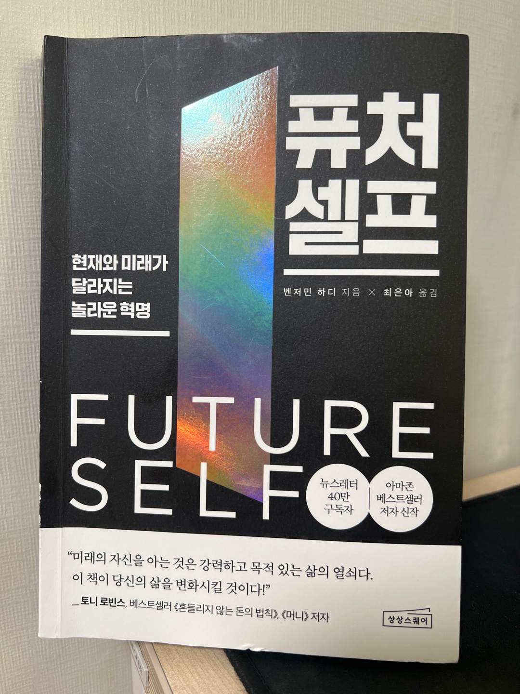

<br>

## 🌈 1. 읽은 계기

나는 스터디언 구독자이다. 신박사님과 고영성 대표님을 5년 전부터 유튜브를 통해 알게 되어, 관련 영상과 추천해주신 책들을 꾸준히 읽어왔다.
이번에도 추천해주신 책 `퓨처셀프`를 읽으면서 관련 영상을 함께 보았다. 이 책을 구매하기 전, 신박사님이 '미쳤다'고 수 천번 말한 모습을 보고 '얼마나 미쳤길래 이렇게 강조를 하시는 걸까?'라는 호기심과 설렘이 생기자 운동하는 도중에 바로 구매했다.(나는 매일 운동하면서 스터디언 영상을 본다.)

솔직히 고백하자면, 나는 책을 1번 이상 잘 읽지 않는다. 그리고 서평도 잘 작성하지 않는다.

하지만 '퓨처셀프'는 달랐다. 그리고 무엇보다 신박사님께서 '퓨처셀프'는 여러 번 읽고, 특강도 보면서 아웃풋으로 서평과 책에서 제시하는 다양한 실천 방법들을 적극적으로 시도해보라고 말씀해주셨다. 이 책을 한 번 다 읽고 나서, 왜 위와 같은 말씀을 해주셨는지 알게 되었다. 이 책은 정말 한 번 읽는 것으로 끝날 수가 없는 책이었다.

나의 삶에 꼭 필요한 문장들이 너무나도 많아 처음 읽었을 때에는 형광펜으로 표시하면서 읽었고, 두 번째 읽을 때에는 노션을 통해 정리하면서 읽었다. 그리고 세 번째 읽을 차례에는 두 번째 읽었을 때, 정리한 노션에 더욱 내 생각을 명료하게 정리해볼 생각이다.

요즘 바쁜 삶 속에서, 공허함을 느낄 때가 많았다. 하지만, 이 책을 통해서 공허함을 왜 느꼈는지, 이 공허함을 채워줄 수 있는 다양한 문장들이 많아 개인적으로 너무나 기뻤다.

나에게 도움을 준 문장들을 하나씩 정리해보고자 한다.

<br>

## 💡 2. 인상깊은 내용

먼저 목차는 크게 3파트로 나누어져있다. 그 중 파트별로 인상깊었던 내용들을 기록하고 정리해본다.

- 미래의 나를 위협하는 요인 7가지
- 미래의 나에 대한 진실 7가지
- 미래의 내가 되는 7단계

### Part 1. 미래의 나를 위협하는 요인 7가지

1. '미래에 대한 희망이 없다면 현재는 의미를 잃는다.'
   - 미래의 목적과 연결되지 않는 현재의 삶은 감옥이다.
   - 원대한 희망을 지닌 사람은 구체적인 결과를 만들기 위해 100% 전념한다. 그들은 흔들림 없이 목표를 확고하게 유지하지만, 목표를 달성하는 과정이나 방법은 매우 유연하게 조정한다.
   - 인생의 명확한 목적이 없으면, 당신의 뇌는 핑계를 찾는데 집중 할 것이다. 결국 희망이 없으면 그 무엇도 아무런 의미가 없다. 미래의 나를 위협하는 가장 심각하고 근본적인 요인은 미래에 대한 희망이 없는 것이다.
2. 과거에 대한 부정적인 스토리를 미래를 위협한다.
   - 당신에게 발생한 실제 사건보다 훨씬 더 중요한 건 그 사건에 어떤 스토리를 입히느냐다. 그 사건에 대해 스스로 어떤 감정을 느끼는지가 중요하지 당신에게 발생한 실제 사건은 그다지 중요하지 않다.
   - 과거와 현재, 미래는 지금 이 순간에 함께 존재한다.
   - 당신은 더는 경험의 산물로 존재하지 않는다. 당신의 경험이 의식적인 선택의 산물이 되는 것이다. 경험이 무엇을 의미하는지는 당신 손에 달렸다. 당신이 경험의 주인이지, 경험이 당신의 주인은 아니다.
3. 주변 환경을 인식하지 못하면 당신은 아무 길이나 가게 된다.
   - 미래의 나는 환경의 산물 이라는 점이다. 정신을 차리고 깨어 있으면 환경을 의식적으로 선택할 수 있다. 잘 선택하라
4. 미래의 나와 단절되면 근시안적인 결정을 내리게 된다.
   - 미래의 나와 연결하려면, 미래의 나를 현재의 나와는 ‘다른 사람’으로 보는게 대단히 중요하다.
   - 현재를 더 나아지게 하는 유일한 방법은 미래를 더 크게 설계하는 것이다.
5. 시급한 문제와 사소한 목표가 당신의 발목을 잡는다.
   - 일한 시간의 양은 중요하지 않다. 중요한 건 일의 목표가 무엇인지다.
6. 경기장에 들어가지 않으면 당연히 패배다.
7. 성공이 실패의 기폭제가 될 때가 있다.
   - 미래의 당신을 명확하게 보고 거기에 초점을 맞춰 장기적으로 전념해야 한다. 미래의 나에게 지속적으로 투자하며 의도적인 연습을 할 때 탁월한 성공을 거둔다.
   - 눈앞에 보이는 덜 중요한 목표를 추구하다가 진정한 목표에서 멀저진다.

### Part 2. 미래의 나에 대한 진실 7가지

<br>

## ✍️ 3. 책을 통한 성찰

<br>

## 🍀 4. 책을 덮으며

<br>

## 참고

- [퓨처셀프](https://www.aladin.co.kr/shop/wproduct.aspx?isbn=K342935366?utm_source=search_ad&utm_medium=google&utm_campaign=nov_bestbook&gad_source=1&gclid=CjwKCAiAvdCrBhBREiwAX6-6UnvcembocUDCmmmkU4OZRzdhFWYXzwSv0fQn3z9f1PQEHn80LrI_6xoCyXEQAvD_BwE)

- [퓨처셀프 인생특강](https://www.youtube.com/watch?v=ZJVZzedpBok&list=PL0-BdeW3LQFPVAcudbw-tt7MeSRdPfMSa)

```toc

```
