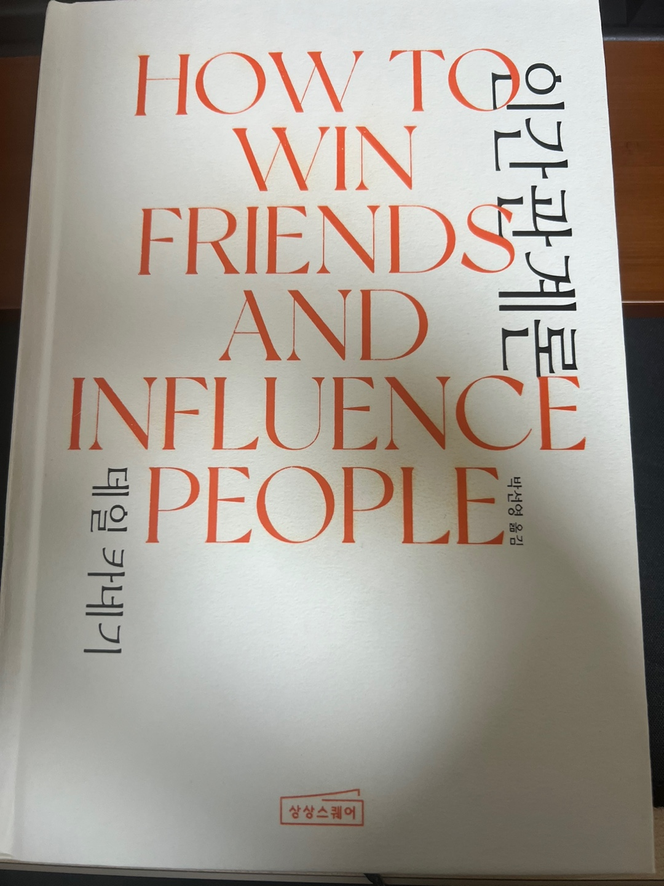

<br>

## 🌈 1. 읽은 계기

먼저 너무나도 유명한 '데일 카네기'의 책이라는 것에 끌렸고, 워렌 버핏이 이 책을 통해 많은 배움을 얻었다고 해서 더 끌렸다. 그리고 내가 좋아하는 상상스퀘어에서 출간한 책이여서 더 기대가 되었다.

'인간 관계'라는 것이 추상적이면서도 많은 명언들을 보면 빠지지 않고 등장하는 단어임에도 살면서 깊게 들여다 보지 않았던 것 같다. 그래서 이번 기회에 '인간 관계'에 대한 배경지식을 넓히고자 책을 읽게 되었다.

<br>

## 💡 2. 인상깊은 내용

사실 책을 읽으면서 너무나도 당연한 내용들이 많았다. 하지만 그 내용들을 실제로 실천한 사람들의 사례를 읽을 때마다 가장 쉬운 것이 가장 어렵구나 생각을 많이 하게 되었다.
그 중에서 인상깊은 문장들을 남겨 본다.

- 남을 비난하지 말자. 남을 비난하기 전에 그들의 입장을 이해하려고 노력하고 들이 왜, 하필 그러한 행동을 취했을까라고 깊이 생각해보자.
- 상대방의 입장에서 사물을 보자. 세ㅇ의 모든 인간은 자기가 원하는 것에만 관심이 있다. 그므로 우리는 우리 자신이 아닌 상대방이 원하는 것에 같이 관심을 기울이자.
- 상대방을 존중해라.

다시 써보아도, 너무나도 뻔한 내용이지만, 삶에서 중요한 내용 같다. 위 문장을 실천하기 위해 순간 순간 애써보았지만 쉽지 않았다.
타인 정말 생각하고 이해할려고 노력해도 나의 감정과 육체의 아픔때문에 나를 더 먼저 생각하는 경우가 매우 많았다. 그래도 어떻게 하면 위의 문장을 내 삶에 녹일 수 있을지 고민을 해보았다. 내가 아닌 사람들에게 무언가를 부탁할 때, '죄송하지만, 실례가 안된다면'의 수식어를 붙여 '다른 사람이 중요한 사람이다'라는 느낌을 줄 수 있도록 하는 방법이 떠올라 실천해보고자 한다.

또한 사람의 호감을 얻는 6가지 방법에 대한 문장이 인상 깊어 적어본다.

- 사람에게 진심으로 관심을 가져라.
- 미소를 지어라.
- 상대방의 이름을 기억하라.
- 상대방의 이야기에 귀를 기울여라.
- 상대방의 관심사에 대해 이야기하라.
- 상대방이 중요한 사람이라고 느끼게 만들어라.

타인들은 나의 이야기보다 자신들의 이야기를 하고 싶어 한다는 이야기가 나온다. 그런 의미에서 위 문장은 다른 사람의 호감을 얻기 위한 가장 좋은 방법인 것 같다. 나 또한 다른 사람의 이야기를 위와 같은 태도로 경청하고 있었는지 반성하게 되었다. 누군가가 나의 이야기를 경청해주기 바라면서 위와같은 문장은 실천하지 않고 있다는 사실을 알게 되었다. 위 문장을 곱씹으면서 체화하기 위해 노력해야 겠다고 다짐을 해본다.

<br>

## ✍️ 3. 책을 읽고 든 생각

먼저 가까이 있는 사람 그리고 소중한 사람들에게 책에 나온 많은 실천 방법들을 하나씩 실천해보면 좋겠다고 생각했다. 그리고 이렇게 실천하는 것도 중요하지만, 실천하는 마음이 더 중요하지 않을까 생각을 해본다. 책에서 나온 내용 중 '비난하지 말라'는 내용이 과연 무조건 '비난 하지 말라'는 내용과는 거리가 멀다고 생각을 했다. 타인을 위해 진정으로 도움을 주고자 한다면 즉 서로 합의가 되었다면 이것은 비난이 아니라 서로의 피드백으로 발전시킬 수 있을 것이라는 생각으로 위 문장을 읽었다.

위 문장처럼 하나의 실천 방안에 많은 내용들이 내포되어 있어 곱씹을 시간이 많이 필요하다는 생각이 들었다.

그리고 색다르면서도 흥미로운 내용이 있었다. 그것은 '협력을 이끌어내는 방법' 챕터의 내용이었다. 예를 들어서 특정 상황(계약, 협상, 업무 지시 등)에서 상대방이 내 제안을 마치 스스로 생각해낸 것처럼 느끼도록 하는 내용이다. 즉, 누가 지시를 내리기 전에, 자발적으로 행동하는 상황을 만드는 내용이었다. 이렇게 하기 위해서는 상대방의 입장을 최대한 이해하고 상대방이 호기심이 있을만한 이야기들을 주제로 대화를 나누면서 자연스럽게 경청하는 모습을 보이면 내가 제안하기도 전에 상대방이 내가 원하는 것들을 자발적으로 이야기를 꺼낸다는 큰 틀에서 이야기가 진행이 된다. 사실 이런 경험이 많이 없지만, 시도해서 나쁠게 하나도 없다고 생각해 먼저 상대방 입장에서 최대한 '경청'하는 습관을 몸에 베일 수 있도록 노력해야 겠다.

<br>

## 🍀 4. 책을 덮으며

책을 읽으면서 뻔한 내용이라고 생각할 문장들이 많았지만, 이런 내용을 의식적으로 생각하지 않고 그냥 살아간다면 인간관계에서 가장 중요한 '좋은 관계'를 형성하기 위해 노력을 할 수 없다는 사실을 알았다. 왜냐하면 사람들은 의식적으로 생각하지 않고 행동하면 무의식적으로 자기 중심적으로 생각하기 때문이다. 물론 나도 포함이다. 그래서 이를 매번 의식적으로 생각하고 행동하는 사람들이 '좋은 관계'를 만들고 더 나아가 '행복'한 삶을 만들어가는데 더 다가가지 않을까 생각을 해본다.

최근에 엔비디아 CEO 젠슨 황이 연설에서 '다른 사람의 말에 경청하는 것이 너무나 중요합니다.'라는 말이 조금은 이해가 갔다.

그래서 지금부터 말보다는 경청하는 횟수를 더 늘릴 수 있도록 노력해야겠다.
<br>

## 참고

```toc

```
