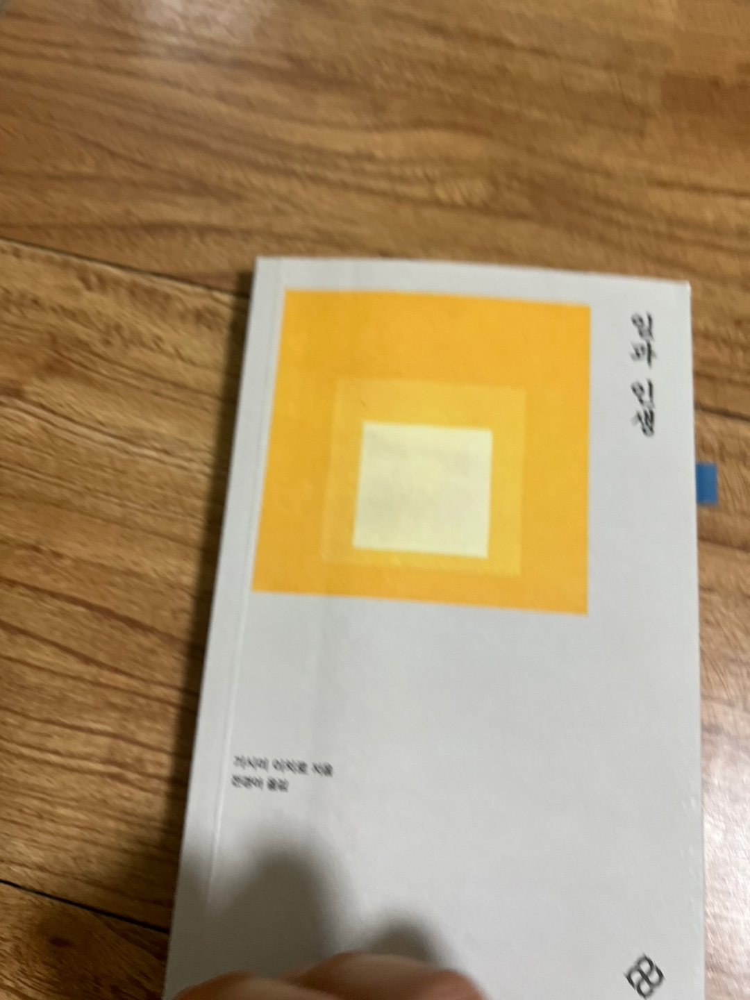

<br>

## 🌈 1. 읽은 계기

우연히 링크드인에 올라온 피드를 보고 관심이 생겨 책을 주문하게 되었다. 책을 주문하고 나서야 저자분이 '미움받을 용기'의 저자라는 사실을 알게 되었다.
'미움받을 용기'를 과거에 읽었을 때, 많은 위로와 힘이 되었던 기억이 있어 이 책을 읽고 싶은 기대감이 많이 올라갔다.

사실 요즘 일과 인생에 대한 생각을 스스로 하곤 하는데, 쉽게 정리가 되지 않아서 도움을 받고자 책을 구매한 이유가 크다.

<br>

## 💡 2. 인상깊은 내용

책을 읽으면서 형광펜으로 밑줄을 긋고 여러번 곱씹은 문장을 아래와 같이 남겨 본다.

### p.34

'자신이 가치 있다고 느끼기 위해 일한다. 인간은 무엇을 위해 일하는가? 일함으로써 인간은 자신의 능력을 타자를 위해 쓰고 타자에게 공헌한다. 타자에게 공헌하면 공헌감을 느끼고, 그럼으로써 자신이 가치 있다고 느낄 수 있다.
따라서 일한다는 것은 자신을 위한 일이기도 한다.'

### p.63

'일이란 진심으로 사랑하고 존경하는 사람에게 보여 주고 기쁨을 주기 위해서 하는 것이다.'

### p.67

'자신이 도움이 된다고 느끼면(공헌감), 자신이 가치 있다고 생각할 수 있고, 그렇게 생각할 때만이 용기를 낼 수 있다. 즉 인간관계를 맺을 용기를 낼 수 있다.'

### p.98

'그런데 인간에게는 미리 정해진 목적이 없다. 무릇 목적은 스스로 정해야 한다. 하지만 목적을 달성하기 위해 오로지 목적을 이루는 데 유용한 행동만 하는게 아니라 쓸데없어 보이는 일도 하는 것이 인간과 기계가 구별되는 점이다.
인간에게는 자유의사가 있기 때문이다. 인간의 삶이 반드시 효율적이어야 한다고 생각하지는 않는다. 인생의 최종 목적지만 똑똑히 확인하면 에둘러 가도 좋다. 때로는 합리적이지 않은 판단을 해야 하는 경우도 있다.'

### p.175

'일이 즐겁지 않을 때는 무엇을 위해 일하는지 생각해 봐야 한다. 일이 즐겁지 않은 이유는 아직 자신이 하는 일이 뭔지 잘 알지 못해서, 다시 말해 일하는 데 필요한 지식과 기술이 모두 충분히 터득하지 않았기 때문이다.
일이 즐겁다고 말할 수 있으려면 일에 숙달되어야 한다. 일에 숙달되더라도 그 일을 통해 어떤 식으로든 공헌감을 갖지 않으면 즐거움을 느낄 수 없다. 타자에게 공헌한다고 느끼고 자신이 가치 있다고 생각할 수 있어야 "무엇을 위해 일하는가?"라는 무제를 푸는 힌트를 얻을 수 있다.'

### p.176

'같은 일을 해도 자신만이 할 수 있는 방식을 궁리하지 않으면 머지 않아 일에는 익숙해지겠지만 의욕이 나지 않을 것이다. 만약 의욕을 갖고 싶다면 궁리해야 한다. 자신이 무엇을 위해 일하는지 확실히 이해해야 한다. 어떤 형태로든 타자에게 공헌한다고 느끼지 못하면 일을 지속하기 어렵다.'

### p.178

'실제로는 아무 일도 일어나지 않는다기보다, 새운 일이 일어나도 알아차리지 못하는 것뿐이다. 그렇게 되지 않으려면 사는 방식 자체를 재검토할 필요가 있다.'

<br>

## ✍️ 3. 책을 읽고 든 생각

책에서 강조하는 '공헌감'에 대해 깊게 생각해보는 시간을 가지게 되었다.

'나는 현재 하는 일을 통해 누군가에게 도움을 주고 있는가?'

구체적으로 떠오르지는 않지만, 그래도 살면서 일을 할 때 위와같은 질문을 끊임없이 하면서 일을 해야 한다는 사실을 알게 되었다.

그리고 '공헌감'을 실천하기 위한 일이 무엇이 있을지에 대한 질문도 스스로 하게 되었다.

그래도 이번 기회에 '공헌감'을 느낄 수 있는 업무를 찾아서 해볼 생각이다.

어쩌면 나의 커리어에서 '공헌감'의 가치가 많이 중요할 것 같다.

<br>

## 🍀 4. 책을 덮으며

'왜 일하는가?'에 대한 정답을 내리는 과정은 간단하면서도 어려운 것 같다.

그러나 이러한 질문을 하지 않으면 사는대로 생각하는 삶 즉, 수동적인 삶을 살 것 같다는 두려움이 든다.

그래서 나는 끊임없이 커리어 및 인생에 관한 책을 읽으면서 생각하는 대로 사는 삶을 즉, 주체적인 삶을 살고 싶다.

그러한 발걸음에 도움을 주는 책을 만나 '공헌감'이라는 가치를 깨닫게 되어 기쁘다.

앞으로 일을 할 때 더나아가 삶에서 '공헌감'이라는 가치를 실현하기 위해 노력해야겠다.

<br>

## 참고

- [일과 인생](https://m.yes24.com/Goods/Detail/122944890)

```toc

```
