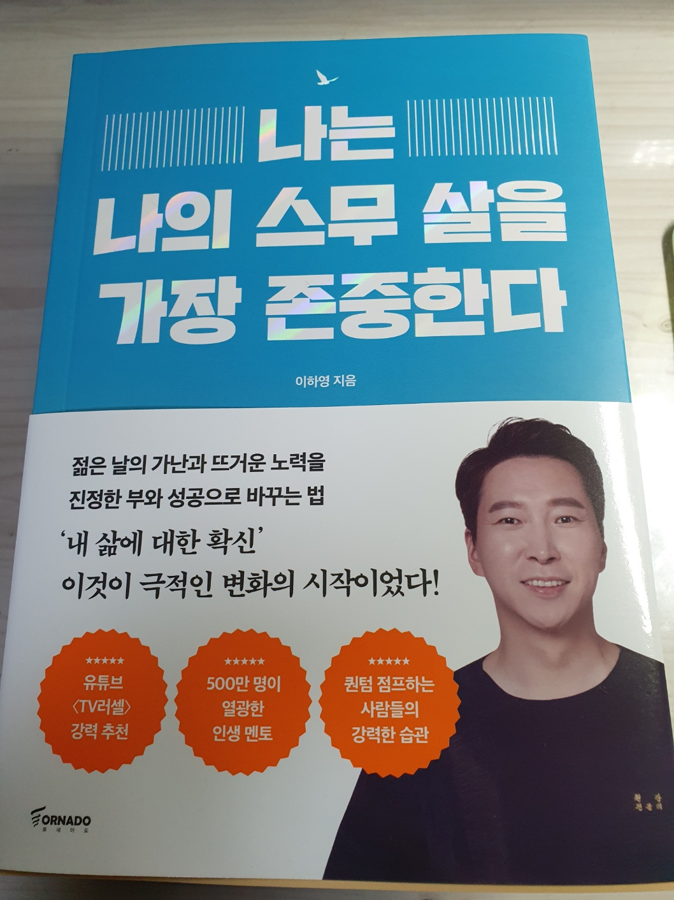

<br>

## 🌈 1. 읽은 계기

우연히 본 유튜브를 통해 작가님을 알게 되었다. 말씀도 잘하시고 무엇보다 자수성가하여 지금의 자리까지 어떠한 가치관과 행동을 통해 세부적으로 말씀해주시는 부분이 인상깊었었다.
그러다가 우연히 작가님 책을 발견하게 되었고 작가님의 생각을 조금 더 깊게 알고 싶어 책을 구매하게 되었다.

<br>

## 💡 2. 인상깊은 내용

개인적으로 인상깊은 내용들이 많았다. 특히 무의식에 대해 많은 이야기를 해주셨는데, 곰곰히 생각해보면 나도 모르게 한 행동들이 무의식에 내재된 부분이 발현되어 나타난 행동임을 알게 되었다.

### 1장. 가난했지만 꿈을 잃지 않았던 이유

- 관념이 바뀌어야 내가 사는 세상이 변하게 된다. 무의식의 의도와 당신의 의도가 일치할 때, 무의식은 공명이 되어 현실에 드러난다. 마음이 나를 통해 세상 이미지로 드러나고 있다. 그게 우리 세상이다. 무의식에 있는 자신의 이미지를 바꿔라.(p.40-41)
- 가난한 현실 속에 머물러 있다면 그 이유는 하나다. 무의식이 가난으로 채색되었기 때문이다.(p.41)
- 미래를 알 수 있는 앎이 있으면, 내가 원는 모든 것을 이룰 수 있다. 미래를 안 다는 것은 무엇일까? 그 앎은 어디서 오는 것일까? 바로 '기억' 이다.앎은 기억을 전제로 한다. 미래는 상상을 통해 인식하는 마음속 이미지다. 상상이라는 도구를 통해 우리는 미래의 이미지를 펼쳐낸다. 상상이 일상이 될 때, 상상은 기억으로 넘어간다. 그러면 그 상상은 앎이 되고, 나에게 항상 느껴졌던 모습의 느낌은 나의 생각과 말과 행동을 바꾼다. 그섯이 변화의 시작이다. (p.46)
- 사소한 말투, 일상적 행동 하나가 미래를 이끌고 있다. 그 말과 행위가 습관이 되고 관성을 지닐 때, 그 관념이 이끄는 삶을 살게 된다. 그래서 '앎'이 '삶'인 것이다. 나의 앎이 습관이 되고, 그 습관이 모여 삶이 된다.(p.48)
- 자존감은 '스스로'가 지키는 마음이고, 자존심은 '남으로'부터 지키는 마음이다. 자ㄴ이 지키는 자신의 존재감이 자존감이고, 타인에게 비치는 자신의 존재감이 자존심이다. 그서 자존감은 높은 것이고, 자존심은 센것이 된다.(p.66)
- 자존감은 스스로 판단하는 자신의 존재 방식을 말한다. 나의 존재 방식은 작가의 삶이었다. 내 인생을 써가는 작가의 삶, 그 삶이 나의 자존감이었다.(p.67)

### 2장. 20대에 알았으면 더 좋았을 것들

- 상식에 내 생각을 맞추는 순간, 인생의 키는 그들에게 넘어간다. 내 생각은 나의 세상을 만들고, 그들의 생각은 그들 세상에 적합한 나를 만든다. 그 차이를 기억하고 질문하라. '나는 대중과 얼마나 다른 생각을 하고 있는가?', '얼마나 다른 일상을 사는가?', '다름'이 많아 질 때 성장할 수 있다.(p.81)
- 대중과 다르게 사는 방법은 '첫 째, 기록하기' 기록은 성장의 원천이다. 축적, 확장, 기억이 성장의 과정이기 때문이다. '둘 째, 명상', '셋 째 운동' (p.85)
- 열심히 살고 있지만, 미래의 불확실성은 우리를 늘 긴장하게 한다. 방향을 잃고 뭔가에 쫓기고 있는 느낌 때문에 두렵다. 이 감정은 어디에서 시작될까? 바로 '무지'다. 인간은 모르기 때문에 두려운 것이다. 미래에 대한 '모름'이 우리를 불안하게 만든다. '의식'은 '인식하는 것'이고, 인식은 '무엇을 아는 것'이기 때문이다. 그래서 우리는 무언가를 알 때 안정감을 느끼고, 편안하다. (p.103)
- 우리는 자아 의지가 아닌, 무의식의 의지로 살기 때문이다. 그래서 인간은 쉽게 바뀌지 않는다.(p.106)
- 어떻게 하면 좀 더 쉽고, 즐겁게 해볼까? 쉽고 즐겁게 해야 즐겁게 해야 잘하게 된다. 잘하려고 하면 잘하지 못한다. 그 잘하려는 무게가 완벽이라는 환상을 만들기 때문이다.(p.121)

### 3장. 매일 조금씩 나를 성장시키는 습관

- 세상은 언어로 이루어져 있고, 내가 쓰는 언어에 따라 나의 세상은 바뀌기 때문이다. 언어로 채워진 세상, 그 세상 속에서 나도 언어로 물들고 있다. 평소 어떤 단어를 자주 사용하는가? 그 단어가 당신의 세상을 만들고 있다.(p.126)
- 어떤 어려움이 닥쳤을 때, 우를 힘들게 하는 것은 그 상황과 사건이 아니다. 잘 살펴보면 눈앞의 사건보다 그 사건을 판단하는 내 생각이 나를 힘들게 한다. 생각이 꼬리에 꼬리를 물고 이어진다. 그 생각들은 대 부분 부정적이다. 그리고 부정적 느낌과 감정을 동반한다. 고통과 괴로움은 정신력으로 극복하는게 아니다. 체력으로 극복해야 한다.(p.133)
- 인생의 큰 목표는 오히려 가장 큰 한계가 된다. 이제는 하루의 작은 성취에 즐거워하고, 세상에 나를 맡긴 채 가볍게 살아 간다. '꼭 되어야 해', '이건 반드시 이렇게 되어야 해'라는 집착을 버리고 가벼운 마음으로 오늘을 채워간다. 오늘이 미래로 이어지는 과정임을 알면 즐겁게 그 삶을 채울 수 있다. 생각과 계획은 내가 하지만, 결과는 세상이 만들고 있다. 그 세상을 믿고 지금 이 순간을 충실히 보내보자. 세상을 만드는 삶의 시선, 나의 무의식과의 만남이 바로 명상이다.(p.143)

<br>

## ✍️ 3. 책을 읽고 든 생각

<br>

## 🍀 4. 책을 덮으며

<br>

## 참고

- [일과 인생](https://m.yes24.com/Goods/Detail/122944890)

```toc

```
