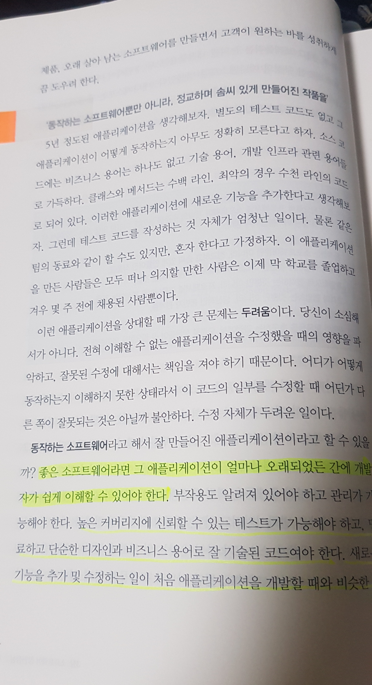
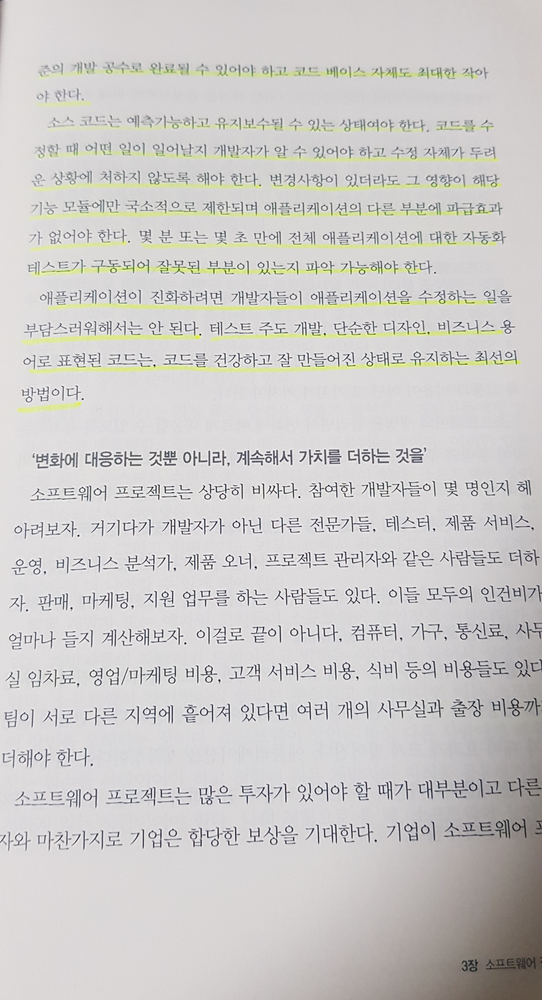

<br>

## 1. 이 책을 읽은 이유💡

욕심이 생겼다. 개발자로서 끝까지 가보고 싶은 마음이 생겼다. 그러나 '어떻게', '무엇을' 해야 할지 막막했다.
마치 바다 한가운데 혼자 있는 듯한 느낌이 많이 받았다. 구글링을 통해 어떻게 하면 개발자로서 성장할 수 있는지 많은 방법이 있었지만 그중에 '독서'는 모두가 추천하는 좋은 방법이었다. 그중에서 필독서로 '소프트웨어 장인'이라는 책이 눈에 띄어 주문해 읽기 시작하였다.
저자 또한 초보 개발자때 겪었던 실수와 그 실수를 헤쳐나가며 지금의 개발자가 되기까지의 경험들을 감사하게도 이 책에 써주셨다. 물론 저자와 다른 문화와 지역에서 개발자로서 일을 하고 있지만, 그래도 일맥상통하는 부분은 어디에서나 존재하기 때문에 본질을 보려고 많이 노력했다. 이 글을 쓰고 있는 시점에 나는 많이 지쳐있다. 그래도 글을 쓰다 보니 다시 동기부여도 된다.
다시 한번 개발자로서 잘하고 싶지만 '어떻게', '무엇을'해야 할지 모르는 사람들에게 강력히 추천한다.

<br>

## 2. 구현을 넘어🔥

사실 개발이 재밋는 이유 중 하나는 내가 작성한 코드가 바로 앱, 웹에 바로 구현이 되기 때문 에이다. 그래서 이게 다인 줄 알았다.
저자도 같은 생각을 하며 일을 했다. 자신의 코드를 남들이 이해할 수 없으면 마치 대단한 사람이 된 것 마냥 자뻑(?)에 취해 일을 했다고 한다. 그러나 이직 후 상사에게 "여기서 메모리 할당/해제를 하면 무슨 일이 일어나는지 알고 있나요?", "try/catch 블록이 이렇게 크면 어떤 일이 일어날 수 있는지 알고 있나요?" 등 전혀 생각지도 못한 질문을 받았다고 한다. 그리고 마지막으로 "이 코드가 얼마나 무례한지 알고 있습니까?"라는 글을 읽었을 때 마지 머리에 망치를 얻어 맞은 기분이었다. 그리고 더 나아가 "일을 하는 것도 중요하지만 그에 못지 않게, 일을 어떻게 하느냐도 중요합니다.라는 문장은 나에게 새로운 시야를 트게 해주었다.



<br>

## 3. 갈길이 멀다 그렇지만 할 수 있다.💪

이 책을 읽지 않았더라면 내 코드에 자뻑(?)에 빠져 우물 안 개구리가 되었을 것이다. 상상만 해도 아찔하다. 이 책을 통해 앞으로 어떤 부분을 생각하며 업무를 진행해야 하는지 대략적으로 알게 되었다. 사실 이 책을 한 번 읽었다고 이 책에 있는 모든 내용을 숙지해 업무에 적용하지는 못한다. 그렇기에 꾸준히 이 책을 보면서 '현재 내가 업무를 잘하고 있나? 혹시 놓친 부분은 없지 않나?' 지속적으로 셀프 피드백을 가져야겠다. 그것이 곧 성장이라고 생각한다.



<br>

## 결론✅

현재 나는 부족하다. 그렇다고 해서 앞으로 부족하다는 생각은 들지 않는다. 그래도 사람인지라 앞서가고 있는 사람들을 보면 많이 불안해하고, 부러워하겠지만 나 또한 그들처럼 멋진 개발자로서 많은 사람들에게 영향을 주는 사람이 되리라 믿어 의심치 않는다. 항상 겸손히 학습하는 자세로 임하면서 앞으로 나아가야겠다. 솔직히 요즘 몸과 마음이 지쳐 다 내려놓고 싶었지만 다시 이 책을 보며 글을 쓰다 보니 동기부여가 되었고 스스로 되돌아보며 조급하게 생각하지 말자고 다짐했다.

```toc

```
