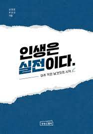

<br>

## **1\. 이 책을 읽은 이유💡**

단순하다 신박사님과 신사임당 님이 썼기 때문에 이 책이 나오자마자 구매를 했다. 특히 신박사님을 강연회에 가서 직접 뵈고 말씀을 듣고 신박사님과 고 작가님의 책들과 소개해준 책들을 읽으면서 스스로도 많이 성장함을 느꼈기에 특히, 이 책은 너무나 기대가 컸다. 역시나 읽으면서 아주 중요하지만 놓치면서 살고 있다는 것들을 많이 깨닫게 되었다. 요즘 특히 책을 읽으면서 시야가 넓어짐을 느낀다. 그래도 아직 부족하다. 책에 나온 내용들을 체화해서 더 나은 나를 만들고 싶다.

<br>

## **2\. 더 나은 인생을 만들기 위해👋**

책에서는 다양한 내용을 소개해준다. 정말 인생 실전에 필요한 무의식에 박혀야 할 내용들 말이다. 그 중에서 새롭게 다가왔던 챕터는 '젊어서 고생은 절대 하지 말아라' 부분이다. 우리는 흔히 어른들로부터 '젋어서 고생은 사서 한다'는 이야기를 자주 듣곤 한다. 나도 물론 그렇다고 생각해 20대에 돈을 안 받고 하는 일들(서포터스, 자원봉사 등)을 많이 했다. 물론 하면서 잊지 못할 추억과 경험을 선사해주었다. 그렇지만 무조건 적으로 고생이 좋다는 막연한 사실을 신박사님이 나에게 일침을 날려주셨다.

```ts
P.124 ~ 125
젊을 때는 고생이 아니라 좋은 경험을 해야 한다.
생산적인 경험을 얻을 수 있다면 자원을 투자해서라도 하는 것이 맞다.
내가 과거로 돌아갈 수 있다면 가장 듣고 싶은 조언중하나다가 바로 다음 내용이다.

"당신이 젋다고 생각하면 버는 돈의 액수에 너무 집착하지 말아라.
능력치를 올리는 것이 돈을 버는 것보다 훨씬 중요하다.
능력만 있으면 큰 돈을 벌 기회는 나중에 많이 있다."

이 조언의 요지는 적은 돈이라도 제대로 버는 것이 중요하다는 것이다.
여기서 '제대로'는 돈도 벌면서 무언가를 배우거나 삶에 대한 시야를 넓혀주는 일들을 말한다.
```

결국 중요한 것은 `제대로`이다. 지금도 주어진 일들에 대해 막연하게 하는 것이 아니라 `제대로`해야 지금의 고생이 성장의 씨앗이 되어 무럭무럭 자라날 수 있다.  
그러니 신박사님이 항상 이야기하는 `의식적 노력을` 체화하자

<br>

## **3\. 조급해하지 말자💪**

가끔 SNS를 보면 젊은 나이에 부자가 된 모습들을 보게 된다. 그럴 때면 '나는 이 나이 되도록 뭐했는지, 나는 과연 얻을 수 있을까?'라는 의문과 조급함이 밀려온다.  
나도 안다. 그들은 정말 극소수이고 내가 놀 때 노력해서 혹은 운이 좋아서 이른 나이에 부자가 되었다는 사실을 그리고 미래에 부자라고 장담할 수 없음을 알고 있다.  
하지만 그래도 부러워 지금 내가 해야 하는 일에 손이 안 잡힐 때가 있다. 그럴 때 이 책을 읽다가 정신 차리게 해주는 챕터를 소개한다.  
바로 `30살 이란 무엇인가?`라는 챕터이다.

```ts
P.97
30살은 젋다.
그것을 빨리 깨닫고 조금씩 부족한 부분을 채워가면 된다.

이때 부터 미리 준비하면 정말 좋은 것이 있다.
바로 건강한 삶을 유지하기 위한 습관을 일찍부터 만드는 것이다.

내가 최선을 다한 일이 정답이 되는 과정이기 때문이다.
내 인생의 문제는 스스로 만든 것이기 때문에 답도 내 안에 다 존재한다.
```

그렇다. 30살은 젊다. 그리고 지금부터 하나씩 부족한 것들을 채워간다면 나는 꾸준히 성장할 수 있다.  
그리고 내가 원하는 미래를 만들어 갈 수 있다. 그러니 제대로 하나씩 준비해 나아가자.

<br>

## **결론😋**

이 책은 우리 가족 대대로 20살이 된 사람들에게 무조건 선물하고 싶은 책이다. 아니 우리가족 모두에게 선물해 주고 싶은 책인다.  
그만큼 삶의 통찰과 내가 생각하지 못했던 생각들을 간접적으로 느낄 수 있는 계기를 만들어 주었으며 한편으로 조급해하던 나를 위로해주었다.  
많은 사람들이 보이지 않은 곳에서 고군분투하고 있다. 물론 나도 열심히 살고 있다. 누구보다 나은 삶을 만들어 가기보다는 서로서로 함께 성장해서 더 나은 세상을 만들어 가고 싶다.  
그렇기 위해서는 내가 먼저 성장해야 하고 좋은 에너지를 주변 사람들에게 주고 싶다.  
요즘 자가격리로 쳐져 있었는데 좋은 동기부여가 되었다.
