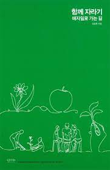

<br>

## **1\. 이 책을 읽은 이유💡**

우연히 개발관련 유튜브를 보다가 이 책을 소개하는 영상을 보게 되었다. 워낙 유명한 개발자 분이 추천해주신 책이라 안 읽어 볼 수 없었다. 무엇보다도 주니어 개발자에게 추천하는 책이라는 말씀에 더욱 내 마음을 사로잡아 이 책을 구매해 읽기 시작하였다.

<br>

## **2\. 경력은 무엇일까?🧐**

이 책을 읽기 전까지 `나는 단순히 경력이 많으면, 실력이 높은 개발자`가 될 줄 알았다.
그러나 이 책에서는 경력보다는 `실력`의 중요성을 강조한 부분이 나에게는 새롭게 다가왔다.

```ts
P.21
실력이 뛰어난 사람은 문제를 이해하는데 시간을 적게 쓰는것으로 나왔다.
```

나도 종종 일하면서 느끼는 거지만 확실히 실력이 있는 개발자 분들이 문제에 직면했을 때 빠르게 이해하고 처리하는 것을 본 적이 있었다. 이와 반대로 경력이 많지만 문제를 이해하지 못하고 문제와 상관없는 것들을 물어보는 안타까운 모습들을 보게 되었다.(물론 다시 한번 문제를 제대로 이해 시켜주기 위해 같이 이야기를 했지만, 안타깝게 자신의 주장을 고집하는 모습을 종종 보게되었다.)

<br>

## **3\. 그러면 어떻게 실력을 키울 수 있을까?💪**

이 책의 저자는 일이 끝나면 `회고`라는 활동을 한다고 말씀한다. 이 문장을 읽으면서 실력을 키우기 앞서 먼저 나를 되돌아보고, 무엇이 부족한지 깨달아 채우는 과정이 실력을 키우는 것에 첫 걸음이라는 사실을 문득 깨닫게 되었다. 막연히 남들이 좋다고 하는 프레임워크나, 언어 공부 등을 하는 것이 아닌 내가 가야할 목표가 무엇이며, 그 목표를 도달하기 위해 무엇이 부족해, 어떠한 학습을 통해 실력을 키울지 이러한 순차적인 생각을 하는게, 먼저 인데 스스로도 조급함에 빠져 정작 중요한 것을 놓치고 있었다.

```ts
P.41
완벽한 도구와 환경을 갖추는 데에 집착해서는 안 된다.
그런 식으로는 무엇도 영원히 얻을 수 없다.
```

위의 생각들이 아직 정리는 되지 않았지만, 그래도 생각들을 차분히 고민하며, 책에서 제시해주는 실력 키우는 방법들을 적용해 필요한 사람이 되고 싶다.

```ts
P. 39 ~ 40

1. 자신이 이미 갖고 있는 것들을 잘 활용
   - 이미 습득한 지식, 기술, 경험 등을 서로 연결지어서 시너지 효과가 날 수 있도록 하여, 다른 영역으로 왔다 갔다하는 것을 자주 할 수 있도록 함
   - 내가 그 지식을 얼마나 어떻게 활요하는지 반성하기
   - 새로운 것이 들어오면 이미 갖고 있는 것들과 충돌을 시도
   - 현재 내가 하는 일이 차후에 밑거름이 될 수 있도록 하기

2. 자신을 개선하는 프로세스에 대해 생각
    - 자신이 작업한 것들을 회고/반성 하는 활동을 주기적으로 하는 프로세스 만들기
    - 나를 개선하는 과정을 어떻게 하면 개선할 수 있을지 고민

3. 피드백을 자주 받기
    - 일찍, 그리고 자주 실패하고 학습하기

4. 자신의 능력을 높여주는 도구와 환경을 점진적으로 만들기
```

<br>

## **느낀점😋**

요즘 많은 사람들이 개발자로써 직업을 바꾸는 모습들을 보며(물론 나 또한 그랬지만) 또는 나보다 먼저 개발을 시작해 좋은 직장에서 개발을 하는 사람들의 이야기를 보면서 스스로에게 불안과 조급함이라는 방 안에 갖히게 만들곤 했었다. 그러나 이 책을 보면서 `진짜 실력있는 개발자로`써 학습하고 노력을 하면 나 또한 개발자로써 많은 기업으로 부터 필요한 사람이 될 수 있을 것 같다는 자신감이 생겼다.
아직도 많이 부족하고 갈 길이 멀지만, 겸손한 자세와 기본기를 탄탄하게 만들어 개발자로서 어디서든 꼭 필요한 사람이 되고 싶다.
