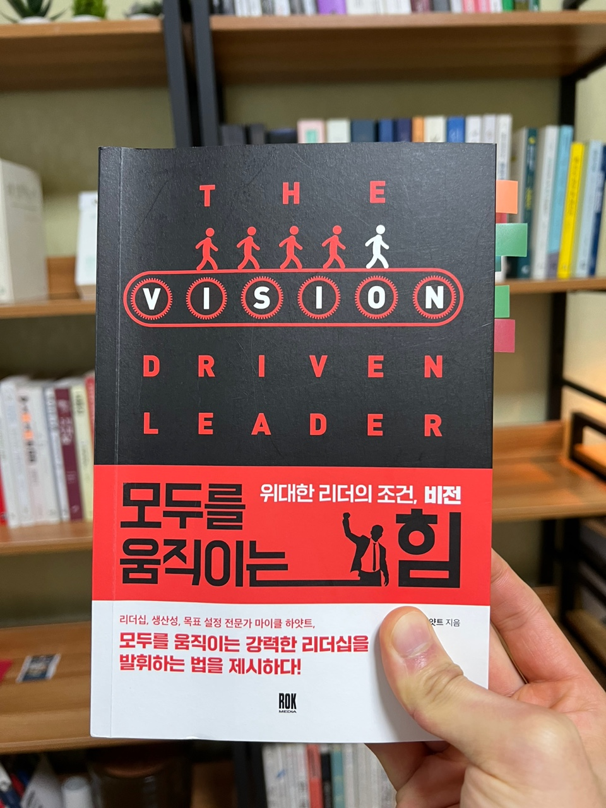

<br>

## **1\. 이 책을 읽은 이유💡**

요즘 무언가 꾸준히 하는 것 같은데, 공허함을 느낄 때가 많이 있었다.
그러다가 체인지 그라운드 영상을 통해, 현재 나는 `비전(가치관)` 없이 행동하고 있다는 사실을 알게 되었다.
이 책은 정확히 내가 원하는 것을 알려 주었다. 비전이 왜 중요한지, 비전을 어떻게 세우는지 방법과
리더가 되기 위해 비전이 꼭 필요하다는 사실 또한 알게 되었다.
책에서도 좋은 리더가 되기 위해, `위대한 리더는, 비전`을 가져야 한다고 써져 있었다.
그래서 더욱 이 책을 통해, 미리 비전을 세우고 좋은 리더가 되고 싶어 이 책을 읽게 되었다.

<br>

## **2\. 나의 비전은 무엇일까?🧐**

이 책에서 `비전`이라는 단어가 많이 나온다. 문득 누군가가 비전은 `보이지 않는 것을, 보는 것`이라는 말을 들었던 것 같다.
이 책은 한 발 더 나아가, 보이지 않는 것을 보이도록 명확하게 만드는 방법과, 다른 사람들에게 비전을 공유해, 이루는 방법들을 하나씩 알려준다. 그리고 리더가 비전이 없을 경우 어떤 문제에 직면하는지도 이 책에서는 자세히 알려주고 있다.

```js
P.45

1. 미래에 대한 대비가 안 되어 있고
2. 기회를 놓치고
3. 우선순위를 정하는 데 우왕자왕하며
4. 전략을 집행하는 데 실수하고
5. 돈, 시간, 인재를 낭비하며
6. 조급하게 마무리를 짓는 경향이 있다.
```

솔직히 이 문장을 읽을 때 움찔 했다. 나 역시 비전없이 살아가고 있음을 이 문장을 통해 확실하게 알게 되었다.

그렇다면 나의 비전은 무엇일까? 딱히 잘 떠올르지 않지만 그래도 이런 사람이 되고 싶다. `많은 사람들에게 필요한 사람으로써 좋은 영향을 주는 사람이 되는 것` 많이 추상적이지만 한 걸음씩 비전을 만들기 위해 노력을 해야겠다.

<br>

## **3\. 그러면 어떻게 나의 비전을 실천 할 수 있을까?💪**

이렇게 비전은 세웠지만, 내 마음을 너무나도 잘 아는 것처럼 책에서 확신이 없을 때 어떻게 하라고 방법까지 알려주고 있었다.

```js
P.116

1. 확신이 없다는 것에 인정한다.
2. 자신감을 방해하는 요인들을 파악한다.
3. 조언을 요청한다.
4. 피드백을 검토한다.
5. 그냥 시작한다.
```

위문장을 차분히 읽었다. 확신이 없다는 것을 먼저 인정했다. 조금은 씁쓸했다. 그렇지만 여기서 가만히 있지 않기 위해 밑에 문장들은 더욱 음미하며 읽었다. 나의 자신감을 방해하는 요인들은 `주변의 시선`이었다. 주변은 나에게 관심이 없는데 내가 오히려 그들에게 지나치게 관심을 많이 갖고 있었다. 또한 일어나지도 않는 일에 대한 `불안`을 가지고 걱정을 하고 있었다. 이렇게 자신감을 방해하는 요인을 제거하기 위해 구글링을 해보니 명상과 운동이 효과가 좋다는 사실을 알게 되었다. 1년 정도 꾸준히 명상과 운동을 하고 있었지만 막연하게 하는 느낌이 없지 않아 있었는데 이 글을 쓰면서 명상과 운동을 꾸준히 해야 하는 이유를 알게 되었다. 이렇게 하나씩 나를 알아가며 내가 설정한 비전을 이루기 위해 시간을 온전히 사용해야겠다.

<br>

## **이제 시작이다😋**

2022년 이제 시작이다.
그러니 조급할 필요도 없다.
차분히 매일매일 해야 할 것들을 집중하며, 왜 이것들을 하는지 나의 비전은 무엇인지 생각하며 행동하겠다.
물론 넘어질 때도 있지만, 그럴 때 이 책을 다시 읽어 앞으로 나아가고 싶다.
`나는 할 수 있다.`
