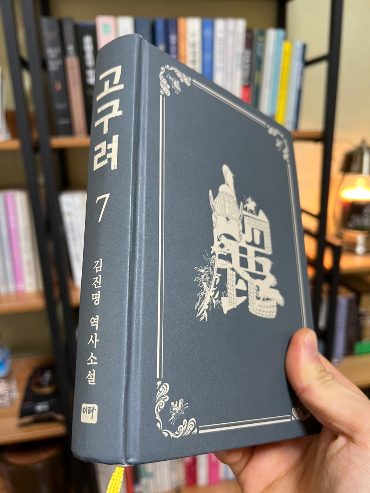

## 먼 옛날 사람들

오랜만에 '알라딘' 중고서점을 방문해 책을 둘러보고 있었는데, 고구려 7권 을 보았을 때 반가웠다.
1권부터 6권까지 읽고 잊고 있었는데 이렇게 발견하게 되어서 너무나 기분이 좋았다.
그날 구매해 읽기 시작하였고, 평상시에 문학이 아닌 다른 장르를 읽고 있었는데 문학이 너무나 재밌게 다가왔다.

사실 앞 내용이 잘 기억이 나지 않았지만, 김진명 작가의 담대하고 솔직한 그 문장이 너무 좋았다.
문장을 한 줄 한 줄 읽을 때마다 책 내용을 시간 가는 줄 모르고 읽기 시작하였다.

책에서 고구부(소수림왕)와 고이련(고국양왕)이 등장해 다양한 이야기가 나온다.

나는 이 책을 읽으면서 고이련이 대신들에게 외면당하고 너무나도 큰 업적을 달성한 형(고구부)의 품 안에서 만족하는 것이 아니라, 스스로 무엇가를 해보려고 노력하는 모습이 너무나 인상 깊었다.

```js
P.148

모든 영광과 높은 자리를 제 형과 아비에게 넘기고
가문과 고구려를 위해 전장으로 나섰던 이들.
그러나 패배를 거듭하고 거듭하며 돌아갈 곳을 잃어버린 채 전장만을 전정하는 방랑자들

"내가 있을 곳이지"

이련은 손에 잡은 말고삐에 힘을 주었다.

```

<br>

## 현재를 살아가고 있는 나

나는 현재 2022년을 살아가고 있다.
고구려 7권 책을 통해 그 시대에 가지고 있던 정신들을 배우게 되었다.
솔직함, 강인함, 이타심, 그리고 삶의 이유 등
많은 인물들이 나오고 저마다 위치에서 최선을 다하며 자신의 뜻을 이루고자 노력하는 모습들을 볼 때면
한 편으로는 부러웠다. 저들은 자신들이 전념해야 할 무언가가 명확한데 나는 그러지 않는 것 같다.
이 시대에 뒤처지지 않기 위해, 끊임없이 정보를 습득하고 공부하고, 돈을 관리하는 방법 등에 집중하다 보니
무언가 텅 빈 느낌을 받을 때가 있다. 하지만 위의 말 한 것들은 삶을 살아가는데 너무나 필요하다.
그럼에도 내가 살아가야 하는 명확한 이유를 알고 싶다.
요즘 많이 몸과 마음이 피곤함을 느끼지만 이럴 때 일수록 나 자신을 되돌아봐야 겠다.
