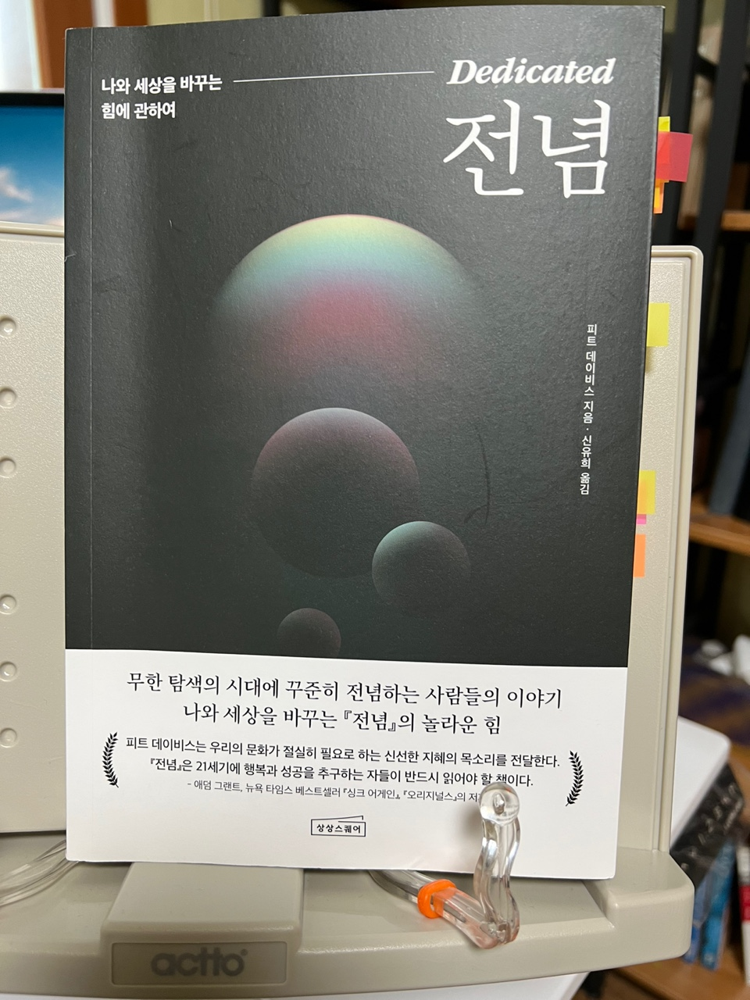

## 집중

이 책을 읽으면서 스스로에게 '나는 무언가에 전념 또는 집중하는 삶을 살고 있나?'라는 질문을 해보게 되었다.
하지만 대답은 쉽게 하지 못했다. 무언가를 열심히 하고는 있지만 돌이켜보면 남아있지 않은 느낌을 받을 때가 많았다.
무엇이 잘 못되었는가 생각하고 이 책을 읽다보니 그 이유를 하나씩 알게 되었다.

나는 `많이`하고 있었다. 즉 하나에 집중하지 않고 여러개를 조금씩 많이 하고 있었다.
그리고 이 책에서 말하는 `전념하기, 집중하기`의 의미는 사뭇 일반적으로 달랐다.

```js
P.41

전념하기의 핵심은 시간을 통제하는 것에 있다.
죽음은 삶의 길이를 통제한다. 그러나 삶의 깊이를 통제하는 것은 나 자신이다.
전념하기는 우리에게 주어진 한정적인 시간을 인정하는 대신,
제한 없는 깊이를 추구하겠다는 결정이다.
```

<br>

## 하나씩

조급하지 않고 그저 하나씩 임하다보니 전념하는 삶을 살게되었고, 원하는 목표에 다다를 수 있었다는 일화들이 많이 등장했다.
그 중에서 인장 깊은 구절을 소개 한다.

```js
P.154

워싱턴 D.C.에서 '버스보이와 시인들'이라는 레스트로랑을 운영하는 앤디 샬릴은
자신의 선택 이후에 펼쳐질 미지의 세계가 일종의 즐거움이었다고 말했다.
전념하기를 결정했을 때에도 전체 여정은 걱정하지 않았다.
그저 바로 다음 단계만 생각했다.

"처음부터 10년짜리 여정을 떠올리지는 않았어요.
그냥 한 번에 한 걸음씩 밟아나가다 보니 여기까지 온 거예요."
```

<br>

## 다짐

나 또한 전념해야 할 시기라는 사실을 알고 있다.
그러나 요즘 생각과 마음이 조급해 손에 잘 잡히지 않을 때가 많다.
이번에 이 책을 통해 마음을 다잡고 하나씩 차분히 전념하기를 통해 원하는 목표에 도달하고 싶다.
