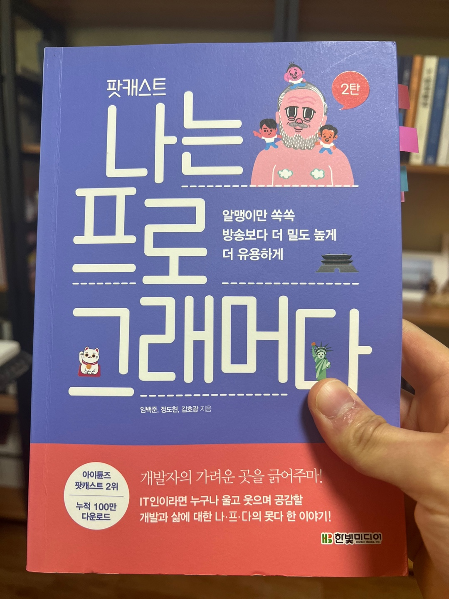

<br>

## 태도와 커뮤니케이션의 중요성

이 책을 읽으면서 다른 개발자들은 어떤 사고와 어떤 경험을 가지면서 개발자로써 살아왔는지 알게 된 시간이었다.
특히, 나처럼 주니어 개발자에게 이 책을 통해 앞으로 갖추어야 할 것들이 무엇인지 확실히 알게 되었다.

```js
P.54

우리가 필요로 하는 것이 커뮤니케이션 능력,
즉 자기가 어떤 문제를 풀고 싶다, 그 문제가 왜 중요한가,
거기에 대한 해결책은 이런 거다, 이 해결책이 왜 좋다,
또 남들이 만들어 놓은 해결책에 대해서 듣고 그것에 대해서 질문할 줄도 알고,
이런 식으로 의사소통을 잘하는 능력이요.

P.56
개발자가 갖추어야 할 커뮤니케이션 능력
- 명확하지 않은 이야기 속에서 지엽적인 것을 걸러내고 본질을 파악하는 능력
- 복잡한 논리나 추상적인 개념을 상대방이 이해할 수 있게 설명하는 능력
- 타인의 감정을 이해하는 공감 능력
```

<br>

그리고 한 줄의 코드를 작성하더라도 `왜`의 깊게 파고드는 태도는 너무나 중요하다는 사실을 어렴 풋이 알고 있었는데, 왜 중요한지 알게 되었고
어떤 식으로 사고해야 하는지도 밑에 글을 통해 알게 되었다.

```js
P.55

한 줄의 코드라도 전후좌우를 둘러싸고 있는 엔지니어링적 요소를
꼼꼼하게 생각하면서 짜는 능력은 단순히 반복된 경험이나,
훈련으로 생기는 것이 아니다.

코드가 메모리를 낭비 없이 잘 사용하는지,
CPU를 효율적으로 사용하는지,이해하기 쉬운지,
코드 베이스 내부의 다른 코드와 정확한 방식으로 상호작용하는지,
테스트하기 쉬운지, 로깅이나 모니터링과 관련해서 필요한 내용을 담고 있는지,
그리고 요구사항을 정확하게 반영하고 있는지,

이런 다양한 요소들을 한꺼번에 전면적으로 고려하는 것은 고도의 능력과 경험을 필요로 한다.
```

<br>

## 개발자 보다 먼저 성숙한 사람이 되자

개발하기 앞서 우리는 모두 사람이다. 그렇기 때문에 사람과 사람의 관계에서 발생하는 문제가 따라온다.
관계에서 발생하는 문제를 해결하는 방법 중 하나가 서로의 상황과 마음을 `공감`해주는 것이다.
하지만 만약 `공감`이 없는 사람과 함께 일하게 된다면??? 상상만 해도 끔찍하다.
그렇기 때문에 이 책에서는 개발 실력도 중요하지만, `공감` 즉 `커뮤니케이션`이 잘 되는 사람이 먼저 되자고 강력하게 말하고 있다.

```js
P.57

사실 코딩을 잘하지만 커뮤니케이션이 형편없는 사람은 보았어도,
커뮤니케이션이 뛰어나면서 코딩을 못하는 사람은 본 적이 없다.
그래서 내가 자신 있게 개발자의 생명이 커뮤니케이션 능력이 말하는 이유다.
```

<br>

그러면 어떻게 `커뮤니케이션` 능력을 키울 수 있을까?? 책에서는 `독서`와 `좋은 사람을 곁에 두기`를 강력하게 추천하고 있다.

```js
P.57

컴퓨터를 끄고, 전화기를 내려놓고 호흡이 긴 독서를 해야 한다.
그리고 좋은 사람을 만나야 한다.
만나서 감정이 소모되거나 자기를 자기답게 만들어 주지 않는 사람은 만날 필요가 없다.

사람들을 만나지 않고 혼자 지내는 것이,
자신의 삶을 훨씬 풍부하게 만들어줄 수도 있음을 깨달아야 한다.

그게 성숙의 의미다.
```

<br>

## 실력있는 개발자

이 책에서 말하는 실력 있는즉, 고수의 개발자들은 어떠한 생각을 하는지 알려주는 부분이 매우 나에게 인상 깊게 다가왔다.
지금부터 이 부분을 준비한다면 당당하게 실력 있는 개발자가 될 수 있다고 확신이 들었기 때문이다.

```js
P.218

여러번 말했지만 고수는 생각한 다음 코딩을하고,
하수는 코딩을 한 다음 생각을 한다.

그렇기 때문에 하수는 실제로 '생각 없이' 코딩을 한다.

코딩을 하다가 막히면 우격다짐으로 밀고 나간다.
불리언 변수와 if-else를 사정없이 도입한다.

바둑에서
고수는 생각을 한 다음에 수를 두었기 때문에 수의 '흐름'을 기억하는 거고,
하수는 아무 생각 없이 수를 두었기 때문에 기억할 내용 자체가 없는 것이다.

생각 없이 코딩을 하기 때문에 뭘 하고 있는지 물어봐도 대답하지 못하고,
코드 리뷰를 하라고 해도 자기 코드를 설명하지 못한다.
여기에 자기방어적 태도나 피해의식 같은게 겹치면 최악이다.
함께 일할 수 없는 사람이 되어 버린다.
```

<br>

그리고 유행하는 프레임워크에 휩쓸리는 부분에 대해 결혼과 연애로 비유해 준 부분도 너무 와닿았다.

```js
P.384

하지만 그런 일시적인 기술은 연애 대상이지 결혼할 대상이 아니다.
프레임워크나 라이브러리를 가져다 쓰는 것은 일종의 연애다.
```

<br>

## 지금 이 자리에서 집중

이 책을 다 읽고, 좋은 개발자가 되기 위해서는 소통하는 능력, 흔들리지 않는 기본기 그리고 트렌드에 맞는 기술을 학습해 사용하는 능력이 중요함을 알게 되었다.

아직 갈 길이 멀지만 그래도 책을 읽으면서 다시 한번 마음을 다잡고 나아가야겠다고 생각했다.
