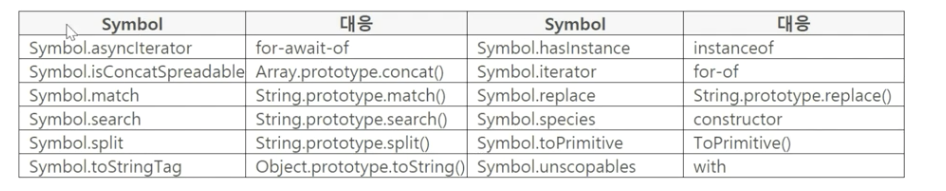

<br>

<h1 align="center">
  👋  Well-Known Symbols
</h1>

<br>

## 1. Well-Known Symbols

- 스펙에서 `@@iterator` 형태를 볼 수 있음
  - ES2019 스펙 : `Well-Known Symbols`
- `@@`
  - `Well-Known Symbol`을 나타내는 기호
  - `@@match` 와 `Symbol.match`가 같음
  - 스펙에서는 `@@match` 형태를 사용하고
  - 개발자는 `Symbol.match` 형태를 사용
- ES2019 기준 : 12개 `Well-Known Symbols`
- `Well-Known Symbols` 이란
  - 스펙에서 알고리즘에 이름을 부여하고
  - 이름으로 참조하기 위한 빌트인 `Symbol` 값
- 개발자 코드 우선 실행
  - `match()` 를 실행하면 디폴트로 `@@match` 를 실행
  - 소스 코드에 `Symbol.match` 를 작성하면
  - `@@match`가 실행 되지 않고 `Symbol.match` 가 실행됨
- 개발자 코드로 디폴트 기능을 오버라이딩 할 수 있음

<br>

## 2. Well-Known Symbols 종류



```toc

```
