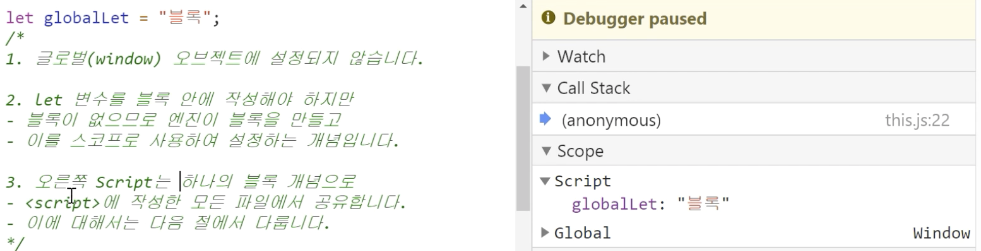

<br>

<h1 align="center">
  👋  let 변수와 this
</h1>

<br>

## 1) 글로벌 오브젝트에서 let변수를 this로 참조 불가

```tsx
var music = '음악';

let sports = '축구';

console.log(this.music, this.sports);

// 음악, undefined
```

1. 현재 위치는 글로벌 오브젝트
2. `var music = "음악";` `window` 오브젝트에 설정됨
3. `let sports = "축구";` `window` 오브젝트에 설정되지 않음
4. `this.music`에서 `this`가 `window` 오브젝트를 참조 하며 `music`이 `window` 오브젝트에 설정되어 있으므로 "음악"이 출력됨
5. `this.sports`에서 sports가 `window`에 설정되지 않으므로 `undefined`가 출력됨

<br>

## 2) 엔진 관점에서 let 변수 처리



- `let` 변수를 블록 안에 작성해야 하지만, 블록이 없으므로 엔진이 블록을 만들고 이를 스코프로 사용하여 설정함
- 위에 언급한 것 같이 현재 `Script`에 `let` 변수에 할당한 값이 존재
- 이것은 `Script`를 하나의 블록 개념으로 `<script>`에 작성한 모든 파일에서 공유 가능

```toc

```
