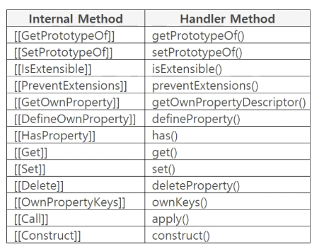

<br>

<h1 align="center">
  👋   handler, trap, target
</h1>

<br>

## 1. target

- `Proxy` 대상 오브젝트 임
  - `Array, Object` 등을 사용할 수 있음
- `const obj = new Proxy(target, {})` 형태에서 첫 번째 파라미터에 `target`을 작성함
- 이렇게 `Proxy` 인스턴스를 생성하므로 `Proxy` 인스턴스와 `target`이 연결됨

<br>

## 2. trap, handler

- `trap` : `Operating System`에서 사용하는 용어로 실행 중인 프로그램에 이상이 발생했을 때 실행을 중단하고 사전에 정의된 제어로 전환
- 가운데 사람이 밥을 받아 자신 앞에 있는 수저를 같이 건네 준다면 `Porxy`에 수저를 건네주는 코드가 필요함 이것이 `Proxy` 를 사용하는 목적임

  ```tsx
  const target = { food: '밥' };
  const hanlder = {
    get(target, key) {
      return target[key] + '.수저';
    },
    set(target, key) {},
  };

  const middle = new Proxy(target, handler);
  const left = middle.food;

  console.log(left); // 밥, 수저

  // 1. trap과 handler를 대략적으로 살펴 봄
  // 2. get()이 getter이고 set()이 setter()임
  // 3. get()과 set()을 trap이라고 함
  // 4. middle.food를 실행하면 [[Get]] 대신에 get() 트랩을 실행함
  // 5. target[key]는 target의 [[Get]]이 실행됨, target[key] 값이 '밥'이므로 '밥, 수저'를 반환함
  ```

- `const handler = {...}`
  - 오브젝트에 `get(), set()`이 있음
  - `handler`를 핸들러 오브젝트라고 하며 약칭으로 핸들러라고 부름

<br>

## 3. Proxy Trap



- `enumerate()`
  - ES6에는 있었느나 ES7에서 `deprecated`

```toc

```
