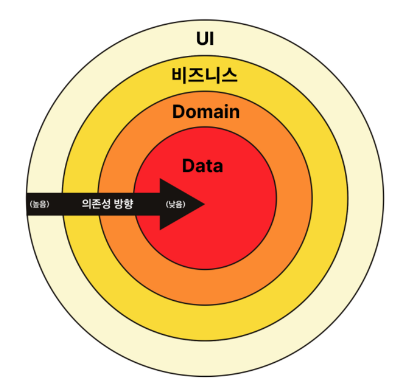

# 💪 배운 내용
- `설계`란 엉킨 코드를 푸는 것

### 엉킨 코드를 푸는 단계
  1. <b>액션 - 계산 - 데이터</b>로 먼저 분리
     - 계산 : 명시적 입,출력 & 계층적 구조, 추상화의 벽
  2. 다시 알맞게 조립(파이프라인)
     - 일급함수 이용
     - 반복문 이용(map, filter, reduce 등)
     - 파이프라인 구조
     - 이터레이터
     - 시간 -> 타임라인
     - ValueCell(책 P.515) & 만들어진 RxJS
     
### 데이터의 단방향 변경 전파
  - 반응형 아키텍처(Reactive Architectures)
    ```md
      1. 사용자 액션(버튼 클릭) 
      2. Action Layer -> Action : SHOW_ACTION
      3. Store -> Server -> Data
      4. View(Chrome)
      5. 사용자에게 보여줌
    ```
  - Redux 아키텍처
    - 각 단계 별로 가는 것이 좋다.
    - Data -> 비즈니스로 점프하지 않도록 주의하자
    
    

<br/>

# 👍🏻 실습
- `Promise`를 구현
  - 에러를 어떻게 핸들링할 것인가를 고민
  - 엣지 케이스를 찾아서 고쳐보기
  - 잘 구현된 라이브러리를 보면서 고민
  - RxJS를 보면서 어떻게 핸들링 하는지 찾아보기

<br/>

### 참고
- [함수형 프로그래밍 스터디](https://github.com/FECrash/FunctionalProgramming)
- [RxJS Visualizer](https://rxviz.com/)
- [RxJS 한번 배워보실래요?](https://yozm.wishket.com/magazine/detail/1753/)

```toc
```
