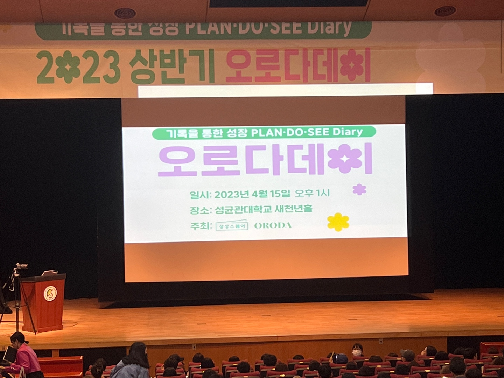

<br>

## 한 주 회고
이번 한 주도 개인적으로 새로운 경험들을 했습니다.
먼저 새로운 회사 컬처핏 면접을 보면서 생각을 말로 일목요연하게 표현하는 부족하다는 사실을 알게 되었습니다. 
이 부분은 앞으로 살아가면서 반드시 잘 해야 하는 능력이라고 생각하기에(잘 설득하는 능력을 매우 중요한 것 같습니다.) 독서와 글쓰기 그리고 스스로에게 질문하고 답하는 연습을 해서
타인에게 정확하게 저의 의사를 전달 할 수 있도록 노력해야 겠습니다.

정말 프론트엔드 개발자로써 실력있는 개발자가 되기위해 필요한 역량을 꼭 키우겠다는 다짐도 해봅니다.

한 주도 너무 애쓴 나에게 칭찬을 합니다.

밑에는 오로다 데이를 참여해 느낀 점과 강연에서 인상깊었던 말씀들을 정리했습니다.

<br>

## 다이어리 강연(오로다 데이)
저는 PDS(Plan Do See) 다이어리를 사용하고 있습니다. 
오늘은 PDS 다이어리를 사용한 사람들이 모여 자신이 다이어리를 사용하면서 변화된 점을 공유하는 강연장에 참석했습니다.
그곳에서는 스터디언 채널의 의장이신 신영준 박사님께서도 좋은 말씀을 해주셨습니다.

막성 강연장에 가보니 참석한 사람들의 연령대가 너무나 다양했습니다. 
즉, 저보다 나이가 많으신 분들도 PDS 다이어리를 사용하며 노력 하고 있다는 사실이 너무나 신기하면서도 동기부여가 많이 되었습니다.

<br>

### 신박사님 말씀
발표에 앞서 신박사님께서 좋은 이야기를 해주었습니다.

<b>우리가 지금 행복해 질 수 있는 방법</b>
1. 관찰 : 주변의 사소한 것이라고 깊게 관찰을 해봅시다.
2. 관점 : 당연한 것을 당연하지 않다고 생각 해봅시다.
3. 관심 : 위에 말한 관찰과 관점을 통해 마음을 두어 봅시다.

<br>

### 6분의 발표 내용
발표자 6분이 다이어리를 통해 변화된 모습과 경험들을 소개해주셨습니다.
발표자 중에는 나이가 많으신 분들도 계셨습니다. 특히 이 분들이 전해주신 이야기가 제게 큰 감동을 주었습니다.
'이 분들도 이렇게 열심히 살아가시는데, 나도 더 열심히 살고 싶다'는 생각이 들었습니다.
저에게 감동과 내적동기를 준 문장들을 아래에 적어보았습니다.
- 회사에 얽매이지 않고 자본주의에서 살아남을 수 있는 실력이 필요하다는 것입니다.
- 차분히 원하는 것들을 하나씩 확장하다보면, 자연스럽게 원하는 목표를 이룰 수 있습니다.
- 꾸준히 포기하지 않고 10분만 더 한다는 마음으로 임했더니 목표를 이룰 수 있었습니다.
- 다이어리에 꼭 감사 일기와 칭찬 일기를 작성했습니다.
- 50대인 저도 포기하지 않고, 지금 내가 할 수 있는 혹은 하고 싶은 일에 집중했습니다.
- 다이어리를 통해 아무 의미없이 흘러가는 시간을 볼 수 있게 되었습니다.
- 하루 시작하기 전에, 오늘 해야할 일에 우선순위를 두었습니다.
- 직업 특정상 누군가의 미래의 시간을 책임지려면, 먼저 제 자신의 시간을 책임져야 한다는 생각을 했습니다.
- 삶이 내 마음대로 되지 않을 수 있다는 것을 깨달았지만, 포기하지 않고 다이어리를 통해 주체적으로 살아가겠다는 다짐을 했습니다.
- 멈추지 않으면 천천히 가는 것은 문제되지 않는다는 공자님의 말씀이 힘이 되었습니다.

<br>

### Q&A
신박사님께서 Q&A 시간에 많은 인사이트를 전해주셨습니다.
- 일을 하기 싫은 마음과 해야한다는 마음 사이를 왔다갔다 하지만, 결국 하는 것이 중요합니다.
- 한계를 넘기 위해서는 계기와 절실함이 필요합니다.
- 기회는 포기하지 않으면 반드시 찾아온다는 신념이 중요합니다.
- 빌게이츠도 1년에 50권 이상의 책을 읽는 것처럼, 우리도 독서를 열심히 해서 성장해야 합니다.
- 다이어리를 사용하는 이유는 우리가 원하는 목적을 달성하기 위한 도구이고, 일상 속에서 우리가 하는 노력이 목적을 이루기 위한 것임을 잊지 말아야 합니다.
- 목적을 이루는 도구와 목적 자체를 혼동하면 안됩니다.

<br>

### 느낀점
솔직히, 오늘 이 행사에 참석하지 않을 생각이었습니다. 
집에서 오고가는데 2시간이 걸리기도 하고, 우선순위가 높지 않은 일정이기 때문이었습니다.
그러나, 다이어리를 사용하시는 분들의 이야기를 듣고 싶은 호기심이 생겨 결국 참석하게 되었습니다.

이번 강연에서 열심히 살아가는 분들이 많다는 것에 놀랐고,
40~60대 분들도 삶에 진지하게 열심히 살아가는 모습을 보면서 제 삶을 되돌아보는 시간을 가졌습니다.

이 행사를 개최해주신 스터디언 운영진과 신박사님께 감사드리며, 저도 꾸준히 다이어리를 쓰며 용기있게 많은 사람들 앞에서 제 이야기를 들려주고 싶은 목표가 생겼습니다.

<br>

### 참고
- [PDS 다이어리 소개 영상](https://www.youtube.com/watch?v=V8iuZ2ApzJM)

```toc
```
